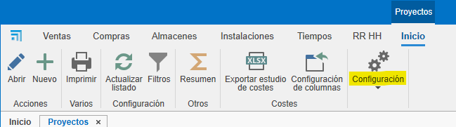
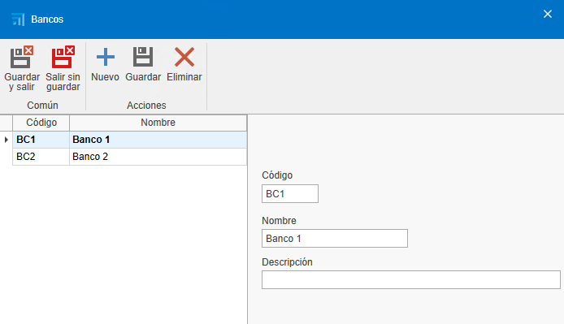
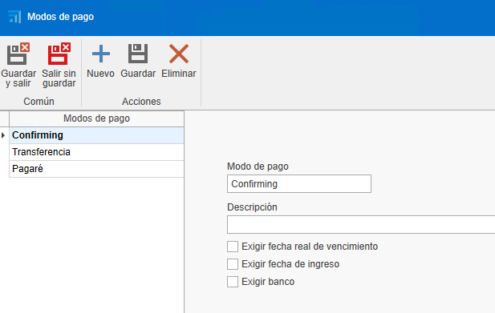

# Configuracion Inical ENBLAU

## Índice

1. [Propósito](#1-propósito)
2. [Configuracion General](#2-configuracion-general)
   - 
3. [Gestión de Pedidos de Compra](#3-)
   - 

---

## 1. Propósito

El presente manual está diseñado para guiar nuevos usuarios con la configuracion inicial de ENBLAU. En la configuración inicial entrará todo lo necesario para que el cliente pueda realizar una venta o una compra, así como realización de facturas.

---

## 2. Configuracion General

### 2.1. General

   - **Ruta de almacenamiento** indicar la ruta donde se guardara los documentos de ENBLAU y Logikal ej:

   

   > **PS:** Mejor a través de unidad de red, de no existir crear.

   - **Informacion empresa** rellenar los campos necesarios con la informacion de la empresa. Nombre, CIF, Direccion, logos, etc..

   

### 2.2. Textos en ventas

- Añadir textos para documentos de ventas, como observaciones, condiciones, etc..

### 2.3. Configuracion Conexion con Logikal

- Para conectar a la fabrica y protyectos de logikal es necesario indicar la ruta de instalacion y dll de Logikal.

- Desde **General** ir a **Logikal - Conexion y Proyectos**.

## 4. Usuario

- Para dar de alta a nuevos usaurios lo puedes hacer desde _"Usuarios"_.

En _Nuevo_ puedes crear nuevos usuarios.

Abrira una ventana para que puedas configurar informaciones del usuario (nombre, direccion, email, telefono, email, etc..), el tipo de usuario (Tecnico, Comercial, Taller, etc...Se puede asignar mas de un tipo) y permisos. Los permisos solo se puede dar por los usuarios de tipo admnistrador.

- Una vez dado de alta a un usuario luego se podra editar.

## 5. Cuentas de email

Para configurar las cuentas de correo de cada usuario se hace desde _"Cuentas de email"_.

## 6. Empresas

- EN el caso de que tengas que mas empresas, puedes crearla en el apartado de Empresas, en **Añadir** luego solo tiene que rellenar las informaciones _General_ y _Textos en ventas_ segun necesario para cada empresa.

>**Imnportante** en caso de que no tengas que indicar otra empresa, en los proyectos se cogera por defecto la que hayas añadido previamente en el apartado de configuracion basica _General_.

## 7. Configuracion Proyectos 

- Desde **Proyectos** ir a configuracion:

- Desde configuracion accederas un desplegable con un listado para configurar. Para una configuracion inicial es necesario configurar _"Estados"_ y _"Directorios por defecto"_.

### 7.1. Estados

   - Al selecionar _Estados_ en el listado de configuracion abrira una ventana de **Estados**. Esa configuracion servira para definir los estados de proyecto (obra).

   

### 7.2. Directorios por defecto

   - Al selecionar _Directorios por defecto_ en el listado de configuracion abrira una ventana de **Directorios por defecto**. Esa configuracion servira para definir los directorios necesarios en la carpeta de documentacion.

   

## 8. Configuracion Ventas

- Desde **Documentos de Ventas** ir a configuracion:

- Desde configuracion accederas un desplegable con un listado para configurar. Para una configuracion inicial es necesario configurar _"Numeraciones"_, _"Formas de pago"_, _"Bancos"_, _"Modo de pago"_, _"Conceptos de roturas"_, _"Clasificasiones"_, _"Sujetos pasivos (IVA)"_ y _"Directorios por defecto"_.

### 8.1. Numeraciones

   - Al selecionar _Numeraciones_ en el listado de configuracion abrira una ventana de **Numeraciones**. Esa configuracion servira para definir los distintos tipos de numeraciones para documentos de ventas para otorgar numeros correlativos al documento.

   

   - Por ejemplo: tipo de documento "Presupuesto", prefijo (Alpha) y numero (seguinte numero) - **PR1000272**

   

### 8.2. Formas de pago

   - Al selecionar _Formas de pago_ en el listado de configuracion abrira una ventana de **Formas de pago**. Esa configuracion servira para definir las formas de pago que necesites para generar vencimentos en la factura.

   

   - Por ejemplo: Lo puedes indicar en cuantas veces y el porcentage que quiere que el cliente pague en cada vencimento.

   

### 8.3. Bancos

   - Al selecionar _Bancos_ en el listado de configuracion abrira una ventana de **Bancos**. Esa configuracion servira para indicar en el Banco...

      

### 8.4. Modos de pagos

   - Al selecionar _Modos de pagos_ en el listado de configuracion abrira una ventana de **Modos de pagos**. Esa configuracion servira para definir los distintos modos en los que podemos realizar el cobro de un vencimento.

   

### 8.5. Conceptos de roturas

   - Al selecionar _Conceptos de roturas_ en el listado de configuracion abrira una ventana de **Conceptos de roturas**. Esa configuracion servira para definir los conceptos de rotura segun necesario.

    

### 8.6. Clasificasiones

   - Al selecionar _Clasificasiones_ en el listado de configuracion abrira una ventana de **Clasificasiones**. Esa configuracion servira para definir las clasificaciones de persupuesto.

    

### 8.7. Sujetos pasivos (IVA)

   - Al selecionar _Sujetos pasivos (IVA)_ en el listado de configuracion abrira una ventana de **Sujeto pasivo**. Esa configuracion servira para definir los tipos de sujetos pasivos.

    

### 8.8. Directorios por defecto

   - Al selecionar _Directorios por defecto_ en el listado de configuracion abrira una ventana de **Directorios por defecto**. Esa configuracion servira para definir los directorios necesarios en la carpeta de documentacion.

    

## 9. Configuracion Compras

- Desde **Documentos de Compras** ir a configuracion:

- Desde configuracion accederas un desplegable con un listado para configurar. Para una configuracion inicial es necesario configurar _"Numeraciones"_, _"Formas de pago"_, _"Clasificasiones"_ y _"Directorios por defecto"_.

### 9.1. Numeraciones

   - Al selecionar _Numeraciones_ en el listado de configuracion abrira una ventana de **Numeraciones**. Esa configuracion servira para definir los distintos tipos de numeraciones para documentos de compra para otorgar numeros correlativos al documento.

   

   - Por ejemplo: tipo de documento "Pedido", prefijo (Alpha) y numero (seguinte numero) - **PE70000082**

   

### 9.2. Formas de pago

   - Al selecionar _Formas de pago_ en el listado de configuracion abrira una ventana de **Formas de pago**. Esa configuracion servira para definir las formas de pago que necesites para generar vencimentos en la factura.

   

   - Por ejemplo: Lo puedes indicar en cuantas veces y el porcentage que quiere que el cliente pague en cada vencimento.

   

### 9.3. Clasificasiones

   - Al selecionar _Clasificasiones_ en el listado de configuracion abrira una ventana de **Clasificasiones**. Esa configuracion servira para definir las clasificaciones de compras.

    

### 9.4. Directorios por defecto

   - Al selecionar _Directorios por defecto_ en el listado de configuracion abrira una ventana de **Directorios por defecto**. Esa configuracion servira para definir los directorios necesarios en la carpeta de documentacion.

    