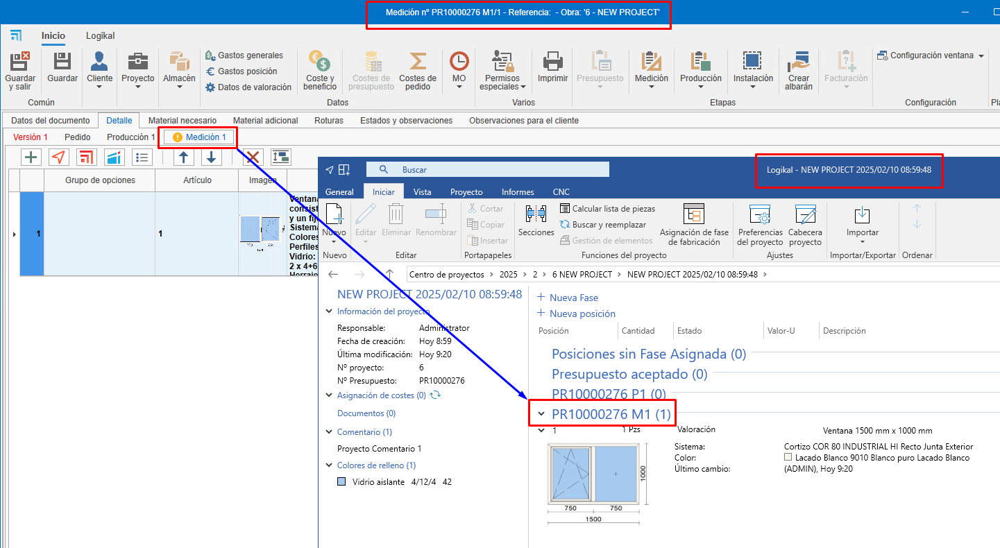

# Relación entre fases en ENBLAU y Logikal

1. [Introducción](#1-introduccion)
2. [Fases - Ejemplos](#2-fases-ejemplos)

## 1. Introducción
Explicación de la relación entre las fases de un proyecto en ENBLAU y Logikal.

---

## 2. Fases - Ejemplos
### Crear un presupuesto desde ENBLAU

1. **Versión 1**  
    - Al crear un presupuesto en ENBLAU, esta versión se reflejará en Logikal en "Posiciones sin Fase Asignada" dentro del mismo proyecto.  
      

2. **Pedido**  
    - Al confirmar el pedido en ENBLAU, se generará un pedido y luego una fase en Logikal denominada "Presupuesto aceptado".  
      

3. **Producción 1**  
    - Desde el pedido en ENBLAU, al crear una producción, se generará una nueva fase en Logikal llamada "nº presupuesto P1".  
      

4. **Medición 1**  
    - Desde el pedido en ENBLAU, al crear una medición, se generará una nueva fase en Logikal denominada "nº presupuesto M1".  
      

5. **Producción 2**  
    - Desde la medición en ENBLAU, al crear una producción (considerando los cambios en la medición), se generará una nueva fase en Logikal con el nombre "nº presupuesto P2".  
      

---

> **Nota:**  
> Al crear un presupuesto en ENBLAU y luego añadir una posición de Logikal, esta se vinculará a un proyecto en Logikal o, en su defecto, se creará uno nuevo.

  

  

  

---
