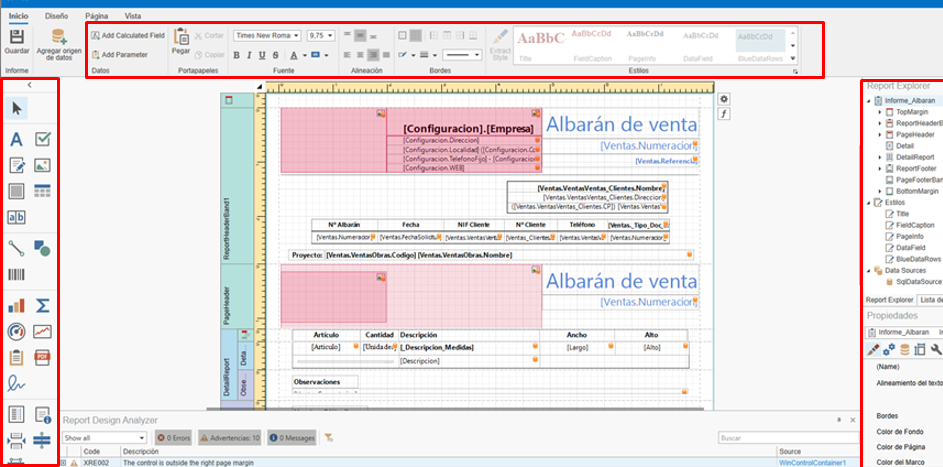
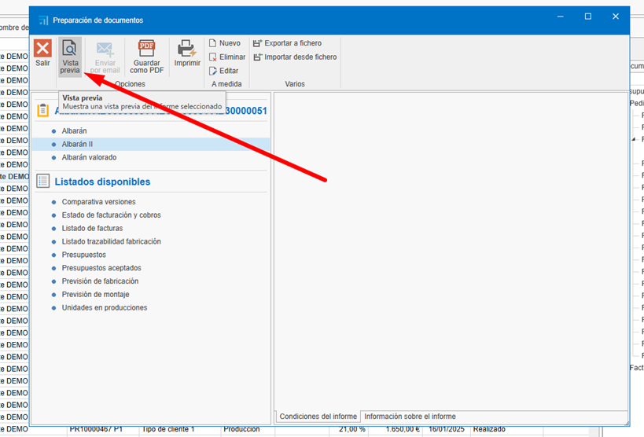
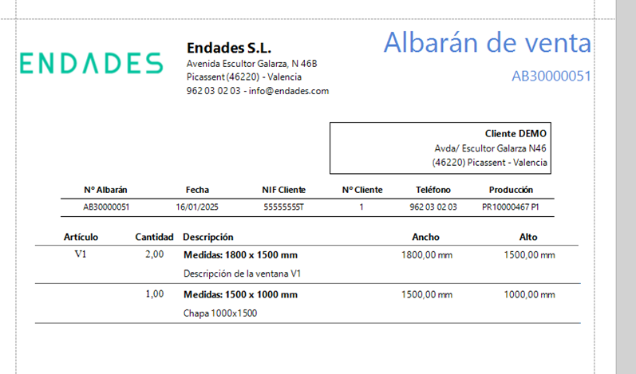

# Creación y Edición de Informes Personalizados

1. [Introducción](#1-introducción)
2. [Creación de un Informe Personalizado](#2-creación-de-un-informe-personalizado)
3. [Edición del Informe](#3-edición-del-informe)
4. [Eliminación de Elementos Adicionales](#4-eliminación-de-elementos-adicionales)
5. [Consideraciones Finales](#5-consideraciones-finales)

## 1. Introducción
Este manual tiene como objetivo guiar a los usuarios en la creación y modificación de nuevas plantillas de informes personalizados sin la necesidad de configurar una nueva plantilla. El proceso está diseñado para ser sencillo y evitar confusiones, permitiendo a los usuarios adaptar los informes a sus necesidades específicas de manera eficiente.

---

## 2. Creación de un Informe Personalizado
Para generar un informe basado en uno existente, sigue estos pasos:

1. **Ubicar el informe base**:  
    - Navega hasta el informe que deseas utilizar como base para tu nuevo informe personalizado.    

2. **Crear una copia del informe**:  
    - Selecciona la opción para crear un nuevo informe a partir del existente. Esto generará una copia exacta del informe original, la cual podrás modificar sin afectar al informe base.

    

    
---

## 3. Edición del Informe
Una vez que hayas creado la copia del informe, sigue estos pasos para personalizarlo:

1. **Ubicar el informe recién creado**:  
    - Accede al informe que acabas de copiar.

2. **Acceder a la opción de edición**:  
    - Selecciona la opción de edición para comenzar a realizar cambios.

    

3. **Realizar los cambios necesarios**:  
    - Modifica los campos, secciones o datos que requieras. Puedes agregar, eliminar o ajustar la información según tus necesidades. Puedes usar los recursos de edicion que tienes disponible para editar la plantilla:

    

4. **Guardar el informe**:  
   - Una vez realizados los cambios, guarda el documento para finalizar la edición.

        

---

## 4. Eliminación de Elementos Adicionales
Si el informe requiere modificaciones más profundas, puedes eliminar secciones o datos innecesarios antes de guardar la versión final. Para ello:

1. **Identificar elementos innecesarios**:  
   - Revisa el informe y determina qué secciones o datos no son relevantes para tu propósito.

2. **Eliminar elementos**:  
   - Utiliza la opción de eliminación para quitar los elementos que no necesitas.

    

    - Para algunos informes (como el ejemplo de Albarán) es necesario eliminar una parte del Script. Acceda al apartado de Script:

     

    - Si esas líneas están en el script, elimínalas:

    

     

    - Volver al apartado de Designer:

         

3. **Guardar los cambios**:  
   Asegúrate de guardar el informe después de realizar las eliminaciones.

## 6. Uso de la nueva plantilla
Una vez creada el nuevo informe, selecionar y ir a "Vista previa":

   

      

---

## 5. Consideraciones Finales
- **No es necesario configurar una nueva plantilla**:  
  Este proceso te permite modificar informes sin tener que crear una plantilla desde cero.

- **Proceso rápido y sencillo**:  
  La clonación y edición de informes es un método eficiente para personalizar documentos.

- **Revisión final**:  
  Antes de guardar el informe, asegúrate de revisarlo cuidadosamente para garantizar que cumple con los requisitos deseados.

---
