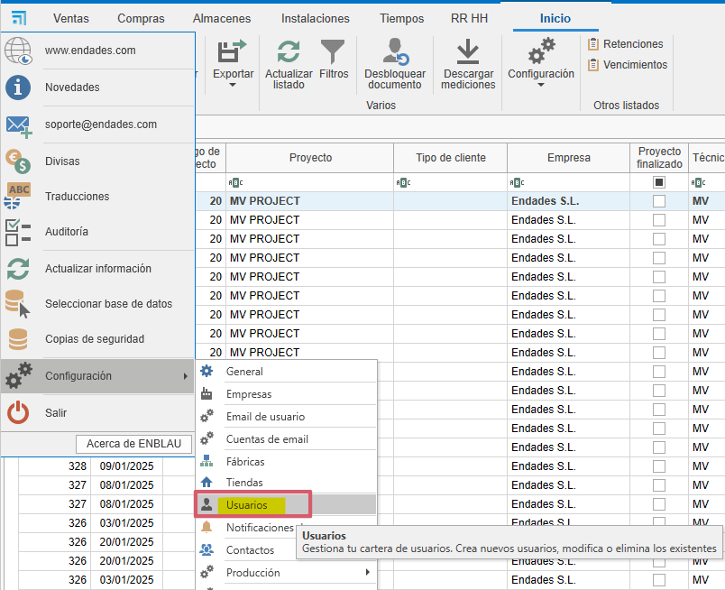
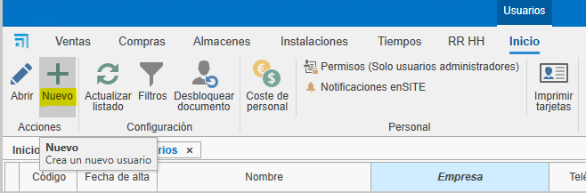
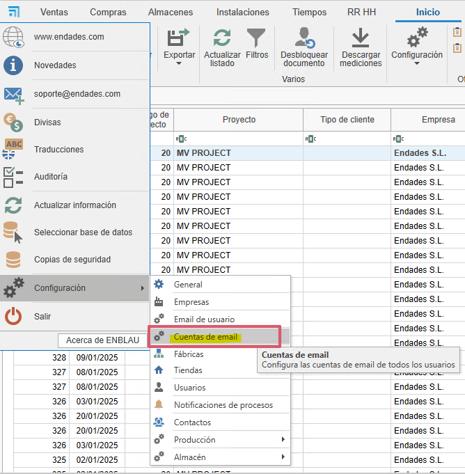
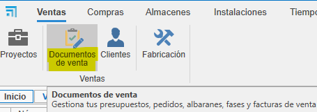
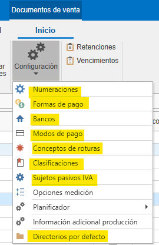
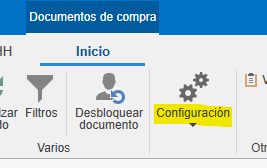
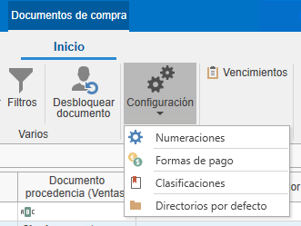

# 1. Configuración Inicial de ENBLAU

<!-- ## Índice

1. [Propósito](#1-propósito)
2. [Configuración General](#2-configuración-general)
   - [2.1. Configuración de Conexión con Logikal](#21-configuración-de-conexión-con-logikal)
   - [2.2. General](#22-general)
   - [2.3. Textos en Ventas](#23-textos-en-ventas)
3. [Gestión de Usuarios](#3-gestión-de-usuarios)
4. [Configuración de Cuentas de Email](#4-configuración-de-cuentas-de-email)
5. [Gestión de Empresas](#5-gestión-de-empresas)
6. [Configuración de Proyectos](#6-configuración-de-proyectos)
   - [6.1. Estados](#61-estados)
   - [6.2. Directorios por Defecto](#62-directorios-por-defecto)
7. [Configuración de Ventas](#7-configuración-de-ventas)
   - [7.1. Numeraciones](#71-numeraciones)
   - [7.2. Formas de Pago](#72-formas-de-pago)
   - [7.3. Bancos](#73-bancos)
   - [7.4. Modos de Pago](#74-modos-de-pago)
   - [7.5. Conceptos de Roturas](#75-conceptos-de-roturas)
   - [7.6. Clasificaciones](#76-clasificaciones)
   - [7.7. Sujetos Pasivos (IVA)](#77-sujetos-pasivos-iva)
   - [7.8. Directorios por Defecto](#78-directorios-por-defecto)
8. [Configuración de Compras](#8-configuración-de-compras)
   - [8.1. Numeraciones](#81-numeraciones)
   - [8.2. Formas de Pago](#82-formas-de-pago)
   - [8.3. Clasificaciones](#83-clasificaciones)
   - [8.4. Directorios por Defecto](#84-directorios-por-defecto) -->

---

## 1. Propósito

El presente manual está diseñado para guiar a los nuevos usuarios en la configuración inicial de ENBLAU. Esta configuración incluye todo lo necesario para que el cliente pueda realizar ventas, compras y la emisión de facturas.

---

## 2. Configuración General

  

### 2.1. Configuración de Conexión con Logikal

- Para conectar con la fábrica y los proyectos de Logikal, es necesario indicar la ruta de instalación y la DLL de Logikal (unidad de red donde apunta Logikal).

- Desde **General**, ir a **Logikal - Conexión y Proyectos**.

  

---

### 2.2. General

- **Ruta de almacenamiento**: Indicar la ruta donde se guardarán los documentos de ENBLAU y Logikal (unidad de red). Ejemplo:

  

  > **Nota:** Es recomendable utilizar una unidad de red. Si no existe, créala.

- **Información de la empresa**: Rellenar los campos necesarios con la información de la empresa, como nombre, CIF, dirección, logos, etc.

  

---

### 2.3. Textos en Ventas

- Añadir textos para documentos de ventas, como observaciones, condiciones, etc.

  

---

## 3. Gestión de Usuarios

- Para dar de alta a nuevos usuarios, accede a **Usuarios**.

  

- En **Nuevo**, puedes crear nuevos usuarios.

  

- Se abrirá una ventana para configurar la información del usuario (nombre, dirección, email, teléfono, etc.), el tipo de usuario (Técnico, Comercial, Taller, etc. Se puede asignar más de un tipo) y los permisos. Los permisos solo pueden ser asignados por usuarios de tipo administrador.

  

- Una vez dado de alta, el usuario podrá ser editado en cualquier momento.

---

## 4. Configuración de Cuentas de Email

- Para configurar las cuentas de correo de cada usuario, accede a **Cuentas de Email**.

  

  

---

## 5. Gestión de Empresas

- En caso de tener varias empresas, puedes crearlas en el apartado de **Empresas**, en **Añadir**. Luego, rellena la información en **General** y **Textos en Ventas** según sea necesario para cada empresa.

  

  

  > **Importante:** Si no se indica otra empresa, los proyectos tomarán por defecto la empresa añadida previamente en la configuración básica de **General**.

---

## 6. Configuración de Proyectos

- Desde el apartado de **Ventas** selecionar **Proyectos**, accede a **Configuración**.

  

  

- Desde la configuración, accederás a un desplegable con un listado para configurar. Para una configuración inicial, es necesario configurar **Estados** y **Directorios por Defecto**.

  

### 6.1. Estados

- Al seleccionar **Estados**, se abrirá una ventana para definir los estados de los proyectos (obra).

  

### 6.2. Directorios por Defecto

- Al seleccionar **Directorios por Defecto**, se abrirá una ventana para definir los directorios necesarios en la carpeta de documentación.

  

---

## 7. Configuración de Ventas

- Desde el apartado de **Ventas** selecionar **Documentos de Ventas**, accede a **Configuración**.

  

  

- Desde la configuración, accederás a un desplegable con un listado para configurar. Para una configuración inicial, es necesario configurar **Numeraciones**, **Formas de Pago**, **Bancos**, **Modos de Pago**, **Conceptos de Roturas**, **Clasificaciones**, **Sujetos Pasivos (IVA)** y **Directorios por Defecto**.

  

### 7.1. Numeraciones

- Al seleccionar **Numeraciones**, se abrirá una ventana para definir los tipos de numeraciones para documentos de ventas, asignando números correlativos a los documentos.

  

  - Ejemplo: Tipo de documento "Presupuesto", prefijo (Alpha) y número (siguiente número) - **PR1000272**.

  

### 7.2. Formas de Pago

- Al seleccionar **Formas de Pago**, se abrirá una ventana para definir las formas de pago necesarias para generar vencimientos en las facturas.

  

  - Ejemplo: Indicar en cuántas veces y el porcentaje que el cliente debe pagar en cada vencimiento.

  

### 7.3. Bancos

- Al seleccionar **Bancos**, se abrirá una ventana para indicar la información del banco. El nombre y un codigo.

  

### 7.4. Modos de Pago

- Al seleccionar **Modos de Pago**, se abrirá una ventana para definir los distintos modos en los que se puede realizar el cobro de un vencimiento.

  

### 7.5. Conceptos de Roturas

- Al seleccionar **Conceptos de Roturas**, se abrirá una ventana para definir los conceptos de rotura según sea necesario.

  

### 7.6. Clasificaciones

- Al seleccionar **Clasificaciones**, se abrirá una ventana para definir las clasificaciones de presupuestos.

  

### 7.7. Sujetos Pasivos (IVA)

- Al seleccionar **Sujetos Pasivos (IVA)**, se abrirá una ventana para definir los tipos de sujetos pasivos.

  

### 7.8. Directorios por Defecto

- Al seleccionar **Directorios por Defecto**, se abrirá una ventana para definir los directorios necesarios en la carpeta de documentación.

  

---

## 8. Configuración de Compras

- Desde el apartado de **Comparas** selecionar **Documentos de Compras**, accede a **Configuración**.

  

  

- Desde la configuración, accederás a un desplegable con un listado para configurar. Para una configuración inicial, es necesario configurar **Numeraciones**, **Formas de Pago**, **Clasificaciones** y **Directorios por Defecto**.

  

### 8.1. Numeraciones

- Al seleccionar **Numeraciones**, se abrirá una ventana para definir los tipos de numeraciones para documentos de compra, asignando números correlativos a los documentos.

  

  - Ejemplo: Tipo de documento "Pedido", prefijo (Alpha) y número (siguiente número) - **PE70000082**.

  

### 8.2. Formas de Pago

- Al seleccionar **Formas de Pago**, se abrirá una ventana para definir las formas de pago necesarias para generar vencimientos en las facturas.

  

  - Ejemplo: Indicar en cuántas veces y el porcentaje que se debe pagar en cada vencimiento.

  

### 8.3. Clasificaciones

- Al seleccionar **Clasificaciones**, se abrirá una ventana para definir las clasificaciones de compras.

  

### 8.4. Directorios por Defecto

- Al seleccionar **Directorios por Defecto**, se abrirá una ventana para definir los directorios necesarios en la carpeta de documentación.

  

---

## 9. Conclusión

Siguiendo este manual, podrás hacer una configuracion inicial de ENBLAU para el uso de creación de documentos de compras y ventas.