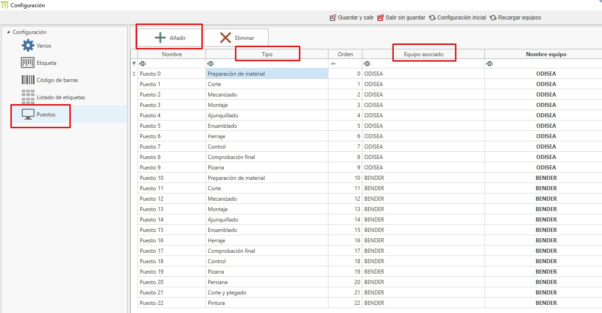
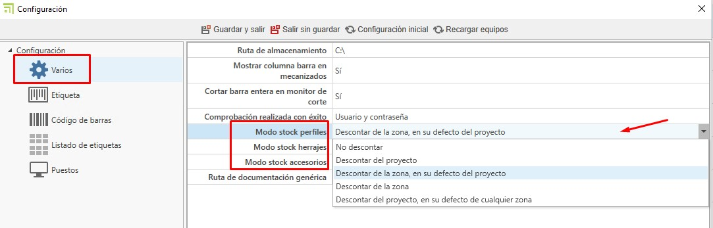
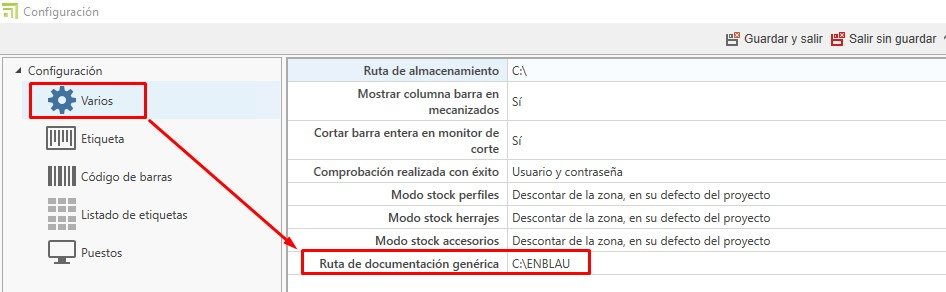
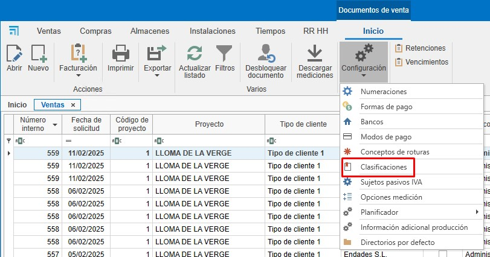
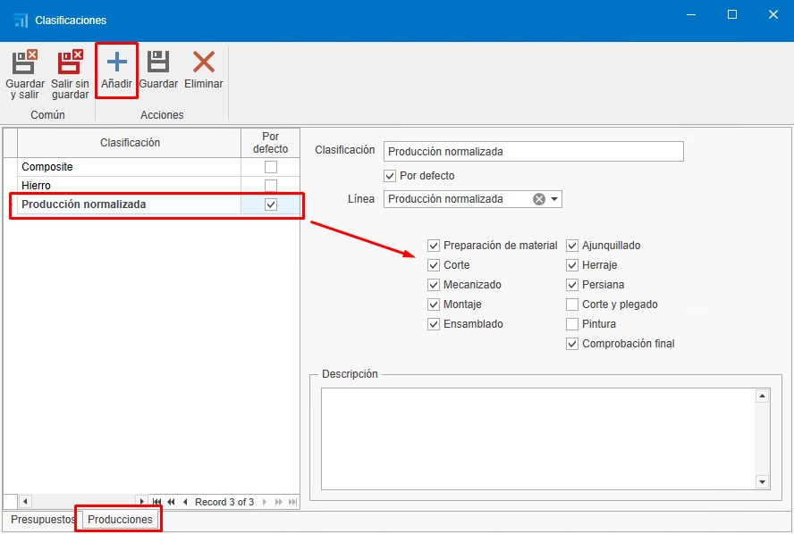
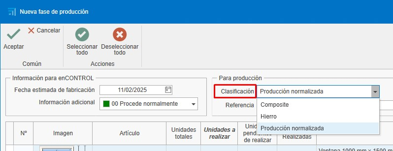
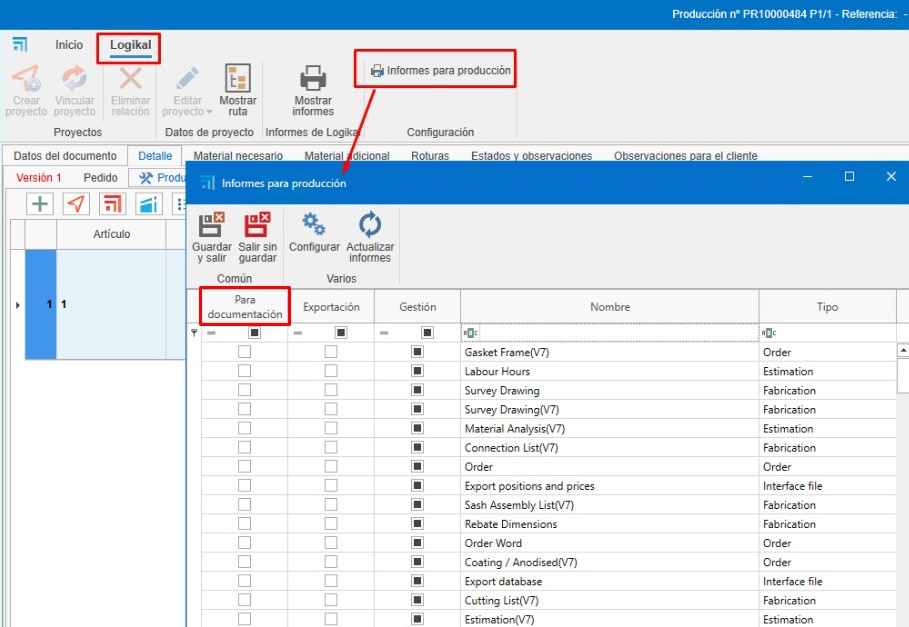
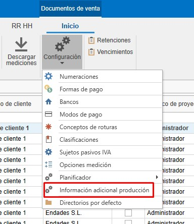
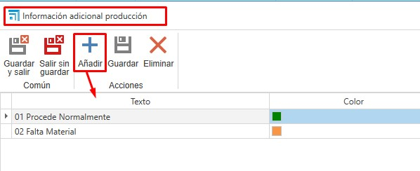
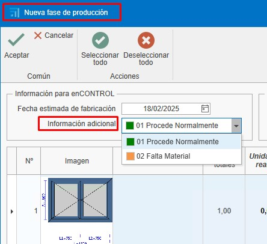

# 2. Configuración Inicial de enCONTROL
---

## 1. Propósito

El presente manual está diseñado para guiar a los nuevos usuarios en la configuración inicial de enCONTROL. Esta configuración incluye todo lo necesario para poner en marcha la producción.

---

## 2. Configuración en enCONTROL

Acceder a la configuración de enCONTROL (F10). Este proceso puede tardar un poco debido a la cantidad de puestos que haya que conectar en red.

### 2.1. Puestos

- En "Puestos" definirás los equipos asociados para cada puesto.

  

---

### 2.2. Varios

- Se define el modo en que se descontará del stock los perfiles, herrajes y accesorios según avanza la producción.

  

    - **No descontar**: No se descuenta de ningún sitio.
    - **Descontar del proyecto**: Se descuenta solo del proyecto, independientemente de la zona.
    - **Descontar de la zona, en su defecto del proyecto**: Se descuenta de la zona indicada y del proyecto.
    - **Descontar de la zona**: Solo se descuenta de la zona indicada, independientemente del proyecto.
    - **Descontar del proyecto, en su defecto de cualquier zona**: Se descuenta del proyecto y de cualquier zona.

- En "Ruta de documentación genérica" puedes indicar documentaciones como información del sistema, entre otros, que se pueda ver desde enCONTROL y los puestos.

  

  Ejemplo en un puesto:

  

---

## 3. Configuración de Producción en ENBLAU

### 3.1. Clasificaciones de Producción

Las clasificaciones en producción se usan de manera informativa al crear una producción para que se refleje en las líneas del puesto en enCONTROL.

- Accede al apartado de Ventas - Configuración - **Clasificaciones**.

  

- Desde "Clasificaciones", crea las clasificaciones que sean necesarias e indica la línea y los puestos de enCONTROL.

  

- Al crear una producción desde un pedido de venta, verás que hay un desplegable de clasificaciones donde puedes indicar la clasificación para esa producción.

  

---

### 3.2. Informes de Producción Logikal

Informes que se requieran y que se generan automáticamente, guardándose como documentación de Logikal en producción. Estos documentos se verán en la ruta de documentación en los puestos de enCONTROL.

- En el presupuesto (producción), accede al apartado de Logikal - **Informes para producción**. Desde allí, marca los informes que quieras que se guarden en producción como documentación en la columna **Para documentación**.

  

**Nota:** Para el tema de la documentación, no cambies nada en las columnas **Exportación** y **Gestión**.

---

### 3.3. Información Adicional

La información adicional es un campo informativo para cuando la producción pase a cola de taller en enCONTROL, de modo que el responsable de taller pueda consultarla.

- Accede al apartado de Ventas - Configuración - **Información adicional producción**.

  

- Desde "Información adicional producción", crea las informaciones adicionales que sean necesarias.

  

- Al crear una producción desde un pedido de venta, verás que hay un desplegable de información adicional donde puedes indicar cómo quieres que llegue esa información a la cola de producción.

  

  

---

## 4. Conclusión

Siguiendo este manual, podrás realizar una configuración inicial de enCONTROL para el uso en la creación de producción.