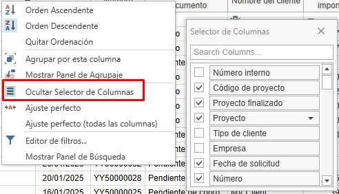
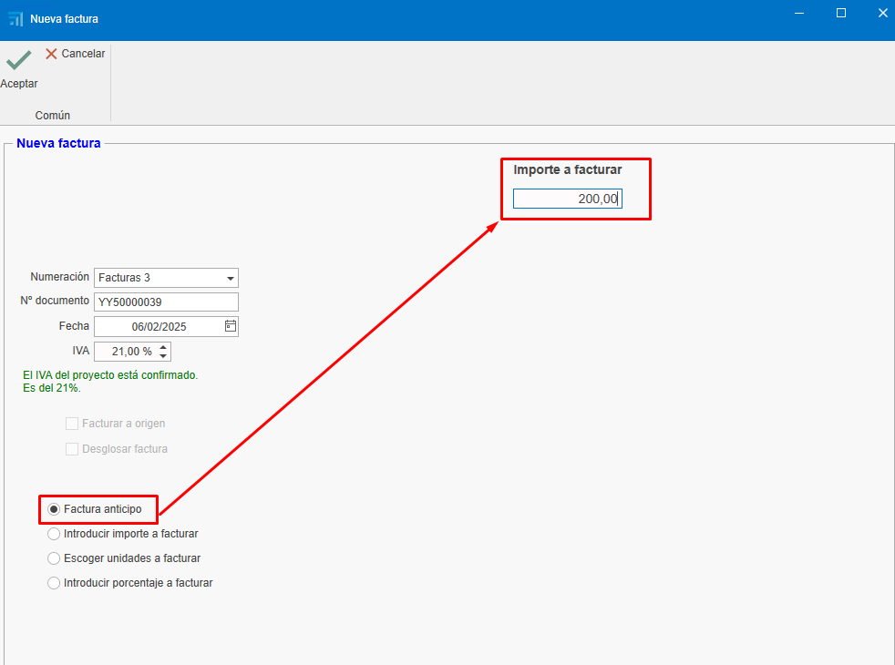

# 2. Facturación

<!-- 1. [Introducción](#1-introducción)
2. [Uso de Filtros en Listados](#2-uso-de-filtros-en-listados)
   - [2.1. Acceder a los filtros](#21-acceder-a-los-filtros)
   - [2.2. Guardar filtros personalizados](#22-guardar-filtros-personalizados)
3. [Creación de Facturas desde Presupuestos](#3-creación-de-facturas-desde-presupuestos)
   - [3.1. Crear un presupuesto](#31-crear-un-presupuesto)
   - [3.2. Generar la factura](#32-generar-la-factura)
   - [3.3. Enviar la factura al cliente](#33-enviar-la-factura-al-cliente)
4. [Gestión de Cobros](#4-gestión-de-cobros)
   - [4.1. Marcar facturas como cobradas](#41-marcar-facturas-como-cobradas)
   - [4.2. Informes de cobros](#42-informes-de-cobros)
5. [Facturación desde Pedidos](#5-facturación-desde-pedidos)
   - [5.1. Facturación desde pedido](#51-facturación-desde-pedido)
6. [Facturación desde Albaranes](#6-facturación-desde-albaranes)
   - [6.1. Crear albaranes desde pedidos](#61-crear-albaranes-desde-pedidos)
   - [6.2. Facturar desde albaranes](#62-facturar-desde-albaranes)
7. [Formas y Modos de Pago](#7-formas-y-modos-de-pago)
   - [7.1. Formas de pago](#71-formas-de-pago)
   - [7.2. Modos de pago](#72-modos-de-pago)
8. [Rectificativas y Anulaciones](#8-rectificativas-y-anulaciones)
   - [8.1. Facturas recién creadas](#81-facturas-recién-creadas)
   - [8.2. Facturas ya enviadas](#82-facturas-ya-enviadas)
9. [Consideraciones Finales](#9-consideraciones-finales) -->

---

## 1. Introducción
Este manual explica el proceso de creación, edición y gestión de facturas. Aprenderás a utilizar filtros, crear facturas desde presupuestos, gestionar cobros y realizar ajustes necesarios.

---

## 2. Uso de Filtros en Listados
Los filtros permiten personalizar la visualización de los documentos en los listados. Sigue estos pasos:

### 2.1. Acceder a los filtros  
- En la cabecera de los listados, utiliza los filtros para definir qué columnas y datos deseas ver.

    

- Por ejemplo, puedes crear un filtro llamado "Facturas" que muestre solo las columnas necesarias (empresa, proyecto, fecha de factura, número, estado del documento, etc.).

    

### 2.2. Guardar filtros personalizados  

- Organiza las columnas según tus necesidades. Puedes eliminar, añadir y cambiar las columnas de posición con el botón derecho sobre cualquier cabecera.

    

- Otra opción para cambiar de posición y eliminar las columnas es arrastrarlas.

    
    
- Desde "Filtros", accede a "Gestión de filtros" y añade un nuevo filtro.

    

- Guarda el filtro con un nombre específico (ej. "Facturas 2").

    

> **Nota:** Cada usuario puede tener sus propios filtros guardados.

---

## 3. Creación de Facturas desde Presupuestos
Para crear facturas a partir de presupuestos, sigue estos pasos:

### 3.1. Crear un presupuesto:

- Añade líneas con los productos o servicios (ej. ventanas, chapas).
- Define cantidades y precios.

    

### 3.2. Generar la factura:

- Accede al apartado de facturación.
- Selecciona "Crear factura" desde el presupuesto.

     

- Elige el tipo de factura:

    - **Factura de anticipo**: Permite cobrar un importe parcial y facturar el resto más adelante.

        

    - **Factura por unidades**: Factura solo las unidades indicadas que quieras facturar. Luego obliga a continuar facturando en el mismo modo (esta marcada por defecto).

        

    - **Introducir importe a facturar**: Permite cobrar un importe específico del total de la factura. Luego obliga a continuar facturando en el mismo modo.

        

    - **Introducir porcentaje a facturar**: Permite cobrar un porcentaje específico del total de la factura. Luego obliga a continuar facturando en el mismo modo.

    

### 3.3. Enviar la factura al cliente:

- Una vez creada, puedes ver la factura en vista previa antes de enviarla o imprimirla.

    

    

     

- Envía la factura al cliente por correo electrónico o imprímela.

    

> **Nota:** La factura se puede generar desde el presupuesto, pedido o albarán. Es recomendable generar las facturas siempre desde el mismo documento, es decir, si haces desde el pedido (el pedido normalmente es el que se acuerda con el cliente), seguir generando las facturas siempre desde ahí para una mejor gestión y trazabilidad.

---

## 4. Gestión de Cobros

Para gestionar los cobros de las facturas:

### 4.1. Marcar facturas como cobradas:

- Desde el propio documento de la factura, se puede marcar que la factura está cobrada.

    

- Otra opción es acceder al listado de vencimientos desde "Documentos de ventas".

    

- Filtra las facturas pendientes de cobro.

    

- Selecciona las facturas y márcalas como cobradas. Para seleccionar más de una factura, usa la tecla **Ctrl + Click** o **Ctrl + A** para seleccionar todas las facturas.

    

- Indica el modo de pago (transferencia, pagaré, etc.), la fecha de cobro y la fecha de ingreso en cuenta. Los campos marcados en rojo son obligatorios. Estos campos se pueden configurar previamente en el apartado "Formas de pago".

    

    > **Nota:** En este apartado, como en otros listados de documentos, se pueden utilizar los filtros según sea necesario.

- En el listado de documentos de ventas, aparecerá en la trazabilidad del presupuesto el estado de la factura como "Cobrado".

    

### 4.2. Informes de cobros:  

- Acepta el presupuesto para que genere un pedido (en el caso de que hayas facturado desde el presupuesto).

    

- Utiliza el informe "Estado de facturación y cobros" para ver el estado de las facturas (cobradas, pendientes, porcentaje de facturación, etc.). Filtra por el presupuesto que quieras que se muestre.

    

    

- Utiliza el informe de listado de facturas para ver la información de la factura (fecha, cliente, base imponible, IVA, total de la factura, etc.). Este informe se puede listar desde un rango de fechas o marcando un check que indica que se aplique solo a las facturas que estén en el filtrado del listado.

    

    

    

---

## 5. Facturación desde Pedidos

Para facturar desde pedidos, sigue estos pasos:

### 5.1. Facturación desde pedido

- Se puede facturar directamente desde "Pedido", siguiendo los mismos pasos que en el presupuesto. 

- Otra manera de facturar sería crear una producción desde un pedido e indicar la cantidad de ventanas que quieres que estén en esta fase de producción. 

    

    

    

- Una vez confirmes que se han fabricado las ventanas indicadas en la fase de "Producción 1", por ejemplo, puedes ir al pedido y crear una factura indicando la cantidad a facturar.

    

> **Nota:** Se recomienda siempre facturar desde el pedido, ya que es lo que se acuerda con el cliente para aceptar el presupuesto.

- En el caso de que descuentes el total de la factura (unidad) y hayas emitido y cobrado una factura de anticipo, al intentar confirmar la factura, te aparecerá un mensaje para confirmar o no que descuentes el anticipo.

    

- Al confirmar, se descontará el anticipo de la factura.

    

- Al generar la factura para enviar al cliente, verás en detalle lo que se ha cobrado y descontado.

    

---

## 6. Facturación desde Albaranes

Si trabajas con albaranes, sigue estos pasos:

### 6.1. Crear albaranes desde pedidos:

- Genera albaranes para las producciones realizadas.

    

> **Nota:** Asegúrate de que los precios y descripciones sean correctos.

### 6.2. Facturar desde albaranes:

- Accede al pedido correspondiente.
- Selecciona "Crear factura" desde el albarán y sigue los mismos pasos anteriores.

    

> **Nota:** Verifica que los precios y las unidades coincidan con lo acordado con el cliente, ya que puede variar dependiendo si hay alguna modificación en la producción (ej. cambiar la medida de la ventana) y que puede afectar el precio y facturar con un precio distinto del pedido.

---

## 7. Formas y Modos de Pago

Configura las formas y modos de pago según tus necesidades:

### 7.1. Formas de pago:

- Define cómo se pagará (ej. 30 días, 60 días, 90 días). Se pueden crear tantas formas como se necesiten con diferentes configuraciones. 

    

- Configura si es necesario exigir el modo de pago, la fecha real de vencimiento, la fecha de ingreso y el banco. Esta configuración se reflejará en el apartado de listado de vencimientos cuando se marque la factura como cobrada y aparezcan los campos en rojo como obligatorios a rellenar. 

    

- Establece el número de vencimientos y los porcentajes de pago.

    

### 7.2. Modos de pago:

- Indica cómo se realizará el pago (transferencia, pagaré, contado).

    

- Configura si es necesario exigir la fecha de cobro, el banco o la fecha de ingreso en cuenta.

    

---

## 8. Rectificativas y Anulaciones

Si necesitas corregir o anular una factura:

### 8.1. Facturas recién creadas: 

- Si la factura no ha sido enviada, elimínala y vuelve a crearla con la misma numeración. Hay diferentes modos de eliminar la factura:

    - Desde el listado de ventas, busca la factura, haz clic con el botón derecho sobre la línea y selecciona "Eliminar".

         

    - Desde la factura, abre la factura y elimínala desde la pestaña "Factura", haz clic con el botón derecho y selecciona "Eliminar".

        

    - Desde la factura, arriba a la izquierda, haz clic sobre el logo de ENBLAU y selecciona "Eliminar".

        

### 8.2. Facturas ya enviadas:

- En el caso de que la factura ya haya sido enviada, emite una factura rectificativa.

    

- Asegúrate de que cumpla con los requisitos de Hacienda.

---

## 9. Consideraciones Finales
- **Mantén los pedidos actualizados**:  
  Todos los documentos deben estar vinculados a un pedido para facilitar el control de costes y facturación.

- **Exportación contable**:  
  Al finalizar el mes, exporta los datos para contabilidad desde el listado de ventas o compras.

- **Dudas y soporte**:  
  Si surge alguna duda, envía un correo al equipo de soporte para resolverla rápidamente.

---

Este manual te permitirá gestionar la facturación de manera eficiente y evitar errores comunes.