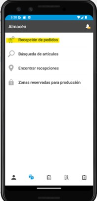
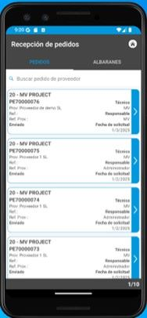
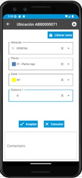
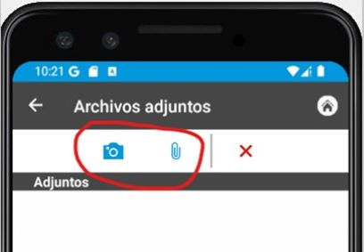
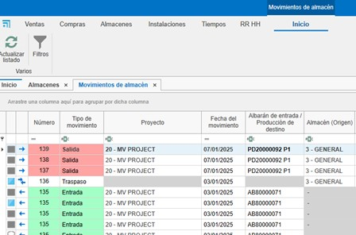
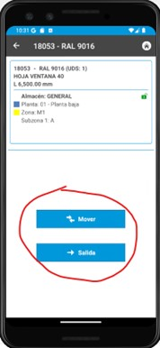

# 3. Sistema de control de stock

<!-- ## Índice

1. [Propósito](#1-propósito)
2. [Acceso al Sistema](#2-acceso-al-sistema)
3. [Gestión de Pedidos de Compra](#3-gestión-de-pedidos-de-compra)
   - [3.1. Pedidos de Compra](#31-pedidos-de-compra)
   - [3.2. Materiales Reservados](#32-materiales-reservados)
   - [3.3. Artículos Importados](#33-artículos-importados)
4. [Recepción de Materiales](#4-recepción-de-materiales)
5. [Gestión de Almacenes y Movimientos](#5-gestión-de-almacenes-y-movimientos)
   - [5.1. Almacenes Layout](#51-almacenes-layout)
   - [5.2. Movimientos en Almacén](#52-movimientos-en-almacén)
6. [Producción y enCONTROL](#6-producción-y-encontrol)
   - [6.1. Producción](#61-producción)
   - [6.2. enCONTROL](#62-encontrol)
7. [Control de Stock y Reportes](#7-control-de-stock-y-reportes)
8. [Resolución de Problemas Comunes](#8-resolución-de-problemas-comunes)
9. [Conclusión](#9-conclusión) -->

---

## 1. Propósito

El presente manual está diseñado para usuarios nuevos en el sistema de control de stock utilizado por los Clientes y Endades. El objetivo principal es proporcionar una guía detallada para la gestión eficiente de proyectos, desde la creación de pedidos hasta la optimización del proceso de producción. Este documento abarca los pasos necesarios para realizar las operaciones clave del sistema y está estructurado de forma secuencial para facilitar su comprensión.

---

## 2. Acceso al sistema

- Inicie sesión con sus credenciales proporcionadas.
- Verifique que el sistema se encuentre en la versión actualizada.
- Acceda al menú principal para visualizar las opciones disponibles.

---

## 3. Gestión pedidos de compra

### 3.1. Pedidos de compra

- Desde el menú principal **Compras**, navegue a la sección "Pedidos de Compra".
- Especifique los materiales requeridos y su cantidad.
- En caso de cambios en las referencias, añádalas manualmente si están configuradas en la base de datos.
- En el pedido de venta (en la sección de **Venta**) selecciona el documento e ir a la pestaña **Materiales** para sacar el listado de los materiales del pedido.
  - Puedes indicar si quieres o no comprar, por si ya tienes en almacén. Te mostrará para cada material la información: unidades en stock, unidades reservadas, unidades pendientes.
- Confirma en **Pedir material** y envía el pedido al proveedor correspondiente.

> **¡Importante!** Para hacer el pedido de materiales en el documento de venta, se requieren permisos especiales para realizar compras. Este permiso también es necesario para fabricar o instalar.

### 3.2. Materiales reservados

- Desde un documento de **Ventas**, **Compras** y en **Proyectos**, se pueden reservar materiales para el proyecto, indicando en **Materiales reservados** desde el desplegable de **Almacén**.

- En **Compras** hay una opción más en el desplegable de almacén llamada **Reposición de stock**.

### 3.3. Artículos

- En el pedido de compras, en la pestaña **Detalle** en la cinta lateral derecha, verás que hay una sección ubicada en la parte inferior llamada **Artículos** y **Artículos importados**.
  - **Artículos**: Son materiales propios creados desde en **MATERIAL**.

  

  - **Artículos importados**: Son los materiales importados de los proyectos de **Logikal**. Son los mismos materiales que están también en Almacén **Materiales importados**.

  

---

## 4. Recepción de materiales enSITE

- En **Almacenes**, acceda a la opción **"Pendientes de Recibir"**. Se abrirá una pestaña con todos los materiales pendientes de recibir para cada proyecto.

- **Modo de recibir**: Se puede hacer desde ENBLAU, pero se recomienda hacerlo desde la app **enSite** en taller.
- Abra **enSite** desde el taller a través de Wi-Fi con la persona encargada de recibir el pedido.
- En **Recepción de pedidos**, localice el pedido correspondiente (ordenado por fecha).

- Registre la recepción en **Nuevo Albarán** creando un albarán desde la sección **Almacén**.

- En ENBLAU, la pestaña **Pendiente de recibir** de **Almacenes** se sincroniza y ya no verás los materiales para ese pedido.
- En **Pedido de Compras**, puedes comprobar la trazabilidad.
- En **enSite**, indique las cantidades recibidas y la ubicación donde se almacenarán (Almacén, Planta, Zona, Subzona…). Luego podrás ver la ubicación de cada material.

> **En caso de materiales dañados u otras incidencias**, puedes adjuntar documentos o capturar fotografías y adjuntarlas al albarán. Luego se podrá revisar desde ENBLAU.

---

## 5. Gestión de almacenes y movimientos

### 5.1. Almacenes Layout

- En el menú principal de **Almacenes**, puedes añadir o editar los almacenes.

- Configura el layout del almacén desde la página inicial: **ENBLAU** – **Configuración** – **Almacén** – **Layout**:

  - Crea zonas, estanterías y posiciones en el sistema para una organización clara. Se mostrará como vista de árbol.
  - Relaciona cada posición con su correspondiente área de almacenamiento. Ejemplo:
    - **Añadir Planta**: Añade una planta y puedes indicar el almacén.
    - **Añadir Zona/SubZona**: Se añade una zona o subzona debajo de la ubicación seleccionada.

    

### 5.2. Movimientos en almacén

- Realiza movimientos de materiales entre zonas:
  - En **Almacenes** – **Detallado**, haz clic derecho sobre el material que quieras traspasar o descontar.

  

  - Selecciona el material desde el proyecto.
  - **Descontar**: Indica el Proyecto, número del pedido, responsable y cantidad/longitud.

    

  - **Traspaso**: Indica la ubicación de origen y destino.

    

- Los movimientos de entrada y salida de cada material se reflejarán en el **Albarán**. Se puede ver las entradas y salidas en **Almacén – Movimientos**.

    

- Desde la app **enSITE**, también se puede buscar por artículos y ver todas las ubicaciones donde está ese artículo. Para luego mover o descontar los articulos.

    
    

---

## 6. Producción y enCONTROL

### 6.1. Producción

- Crea proyectos de producción basados en los pedidos de cliente.
  - Crear producción.

    

  - El siguiente paso es **Enviar a producción**.

    
    

  - En producción, se puede ver en **stock necesario** los materiales descontados. Se puede descontar manualmente.

    
    

### 6.2. enCONTROL

- Abre **enCONTROL**. Aparecen los proyectos de producción. Si eres usuario administrador, verás todos los proyectos, si no, solo verás los asignados.
- Abre el **monitor de control**. Puedes abrirlo haciendo doble clic en cualquiera de los filtros (en la cabecera) o haciendo doble clic en el proyecto y seleccionando el puesto de **Control**.

    

- Cuando se envía a producción (Taller), se coloca en cola de producción en la pestaña de **Gestión de Producción**. El responsable de producción decide la prioridad.

    

- Para añadir, solo tienes que arrastrarlo y se abrirá una ventana de **Tarea** para proponer una fecha.

    

- En la pestaña Planificación de producción defines a quien se asigna, arrastrando los proyectos a cada responsable por hacer. Hay que seleccionar el responsable y arrastrar el proyecto (se puede seleccionar más de uno responsable con ctrl + botón derecho). También se puede cambiar la prioridad  de izquierda a derecha y de arriba a abajo:

  

- En la pestaña Calendario de producción en base a los tiempos de Logikal (en el ejemplo) fechas de entrada y salida de producción.

  

- Optimice los procesos según las áreas de producción (corte, mecanizado, ensamblado, etc.). En la pantalla de proyecto con doble clic sobre el proyecto deseado, te abrirá una ventana Seleccione un puesto. (Los puestos se definen como el cliente decida y se verá según el usuario) ejemplos:

  

- Preparación de Material
    - Todo preparado – Marca los materiales con un check en verde indicando que está preparado.
	- Nada Preparado – Marca los materiales con una X en rojo indicando que no está preparado.
	- Ubicación Material – Según lo tengas configurado enCONTROL, se podría indicar donde ubicar los materiales. Para que se descuente ese material solo de esa ubicación. 
	- Finalizar - seria la fecha real.
	- Documentación - añadir una ruta genérica para añadir lo que quiera. Catálogo, manuales, etc...
	- Comentarios - Se puede añadir comentario y escoger una severidad en el desplegable. El ultimo comentario bueno es el que desbloquea.

      

> Todas las pantallas de Puesto son muy similares. Solo que algunas puede que se descuente materiales y otras es a nivel de información. 

- Corte
    - En corte se indica la longitud de la barra y el desperdicio de retales. Se abre una ventana de retales y puede cambiar la longitud según se necesario.
	- Luego en ENBLAU Movimientos de almacén se reflejará una salida de la barra total ej. 6500 y luego una entrado de la del mismo material de ej. 5500 según había indicado en el puesto de corte.
- Mecanizado
	- No se descuenta materiales, simplemente es informativo por tiempo. Contrasta tiempo reales.
- Montaje
    - Se descuenta materiales (accesorios) por cuadro.
- Ajunquillado
    - Se descuenta materiales (Juntas) por cuadro.
- Ensamblado
    - Información del cuadro, pero no se descuenta materiales.
- Herraje
    - Se descuenta materiales (herraje) por hoja.
- Comprobación final
    - No se descuenta materiales.
- Pizarra
    - Muestra la evolución de cada proyecto y su estado.
- Control
    - Abre el monitor Control de proyectos

- Asigne prioridades y recursos para asegurar la fluidez en la producción.

> **Configuración enCONTROL** (Usuario Adm) - Define algunas configuraciones por defecto y se asigna nuevos Puestos:

  
  

- En Varios Hay diferentes modos para descontar los materiales (Perfiles, Herrajes y Accesorios).

    

    - **No descontar**: No se descuenta de ningún sitio.
    - **Descontar del proyecto**: Se descuenta solo del proyecto. Independiente de la zona.
    - **Descontar de la zona, en su defecto del proyecto**: Se descuenta de la zona indicada y del proyecto.
    - **Descontar de la zona**: Solo se descuenta de la Zona indicada. Independiente del proyecto.
    - **Descontar del proyecto, en su defecto de cualquier zona**: Se descuenta del proyecto y de cualquier zona que tenga ese material.
   
---

## 7. Control de stock y reportes

- Monitorea el stock necesario desde la sección "Producción".
- Identifica materiales reservados y pendientes en tiempo real.
- Genera reportes de inventarios para evaluar el uso de materiales y planificar futuras compras.

---

## 8. Resolución de problemas omunes

- **Error al importar referencias**: Verifica que las referencias estén configuradas en la base de datos.
- **Materiales sobrantes o faltantes**: Asegúrate de registrar correctamente las ubicaciones y cantidades al recibir materiales.
- **Problemas con el layout del almacén**: Revisa la configuración de zonas y ajusta según sea necesario.

---

## 9. Conclusión

Este manual ofrece una guía paso a paso para los procesos principales en el sistema de control de stock. Siguiendo estas instrucciones, los usuarios podrán gestionar eficientemente los inventarios, mejorar la producción y optimizar la relación con proveedores. Para soporte adicional, contacte al administrador del sistema.
