# 4. Proyectos, Clientes y Proveedores

---

<!-- ## Índice
1. [Introducción](#1-introducción)
2. [Proyectos](#2-proyectos)
   - [2.1. Creación de Proyectos](#21-creación-de-proyectos)
      - [2.1.1. Nuevo Proyecto](#211-nuevo-proyecto)
      - [2.1.2. Detalles del Proyecto](#212-detalles-del-proyecto)
      - [2.1.3. IVA y Retención](#213-iva-y-retención)
      - [2.1.4. Documentación del Proyecto](#214-nuevo-proyecto)
   - [2.2. Documentos Relacionados](#22-documentos-relacionados)
      - [2.2.1. Documentos de Ventas y Compras](#221-documentos-de-ventas-y-compras)
      - [2.2.2. Programación de Tareas](#222-programación-de-tareas)
3. [Clientes](#3-clientes)
   - [3.1. Creación de Cliente](#31-creación-de-cliente)
      - [3.1.1. Nuevo Cliente](#311-nuevo-cliente)
      - [3.1.2. Detalle del Cliente](#312-detalle-del-cliente)
      - [3.1.3. Otros Datos](#313-otros-datos)
      - [3.1.4. Documentación](#314-documentación)
4. [Proveedores](#4-proveedores)
   - [4.1. Creación de Proveedor](#41-creación-de-proveedor)
      - [4.1.1. Nuevo Proveedor](#411-nuevo-proveedor)
      - [4.1.2. Detalle del Cliente](#412-detalle-del-proveedor)
      - [4.1.3. Otros Datos](#413-otros-datos)
      - [4.1.4. Documentación](#414-documentación) -->

---

## 1. Introducción
Este manual está diseñado para guiar a los usuarios en la creación de Proyectos, Clientes y Proveedores en ENBLAU. De esta manera, se pueden asignar correctamente a los documentos de venta y compra.

---

## 2. Proyectos
El proyecto es como la "obra". Se asocia a un proyecto cuantos documentos de ventas y compras sean necesarios.

### 2.1. Creación de Proyectos
- Desde el apartado de Ventas, puedes acceder a Proyectos.

  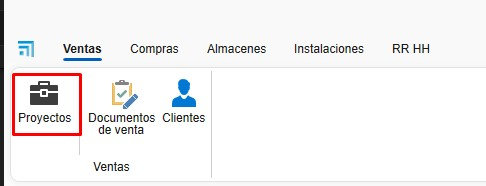

#### 2.1.1. Nuevo Proyecto
- Crea un proyecto desde el botón "Nuevo".

  

- Asigna un nombre y selecciona el cliente.

  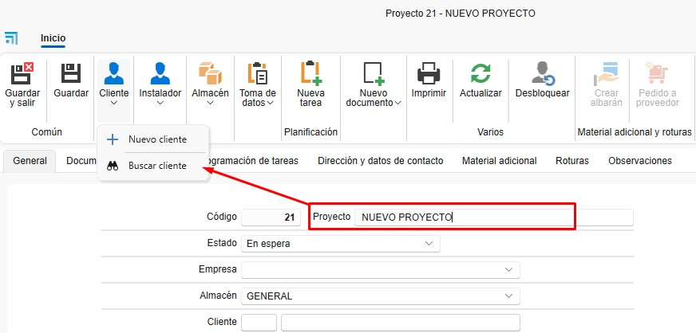

#### 2.1.2. Detalles del Proyecto
- Desde la pestaña **General**:
  - Empresa
  - Técnico de obra.
  - Comercial.
  - Responsable de compras.
  - Responsable de facturación.
  - Etc.

  

#### 2.1.3. IVA y Retención
- Puedes confirmar el IVA y la retención con el cliente para el proyecto, lo que podría evitar errores en facturas.

  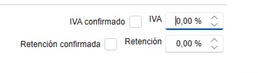

#### 2.1.4. Documentación del Proyecto
- Desde **Documentación del proyecto**, puedes subir documentaciones, manuales, etc., todo relacionado con el proyecto.

  

- Con un doble clic sobre la carpeta principal, se abre la ruta donde está el ID de la obra.

  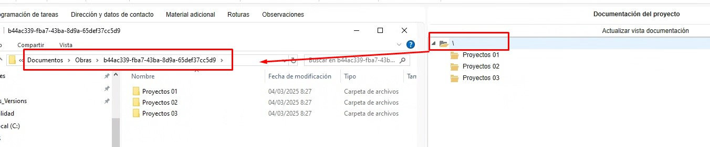

- Las subcarpetas se pueden crear directamente en la ruta o previamente desde la configuración en proyectos **Directorios por defecto**.

  

### 2.2. Documentos Relacionados
#### 2.2.1. Documentos de Ventas y Compras
- Todos los documentos relacionados con el proyecto se agrupan aquí.

  

#### 2.2.2. Programación de Tareas
- Gestiona las tareas asociadas al proyecto. Las tareas se pueden asignar por documento.

  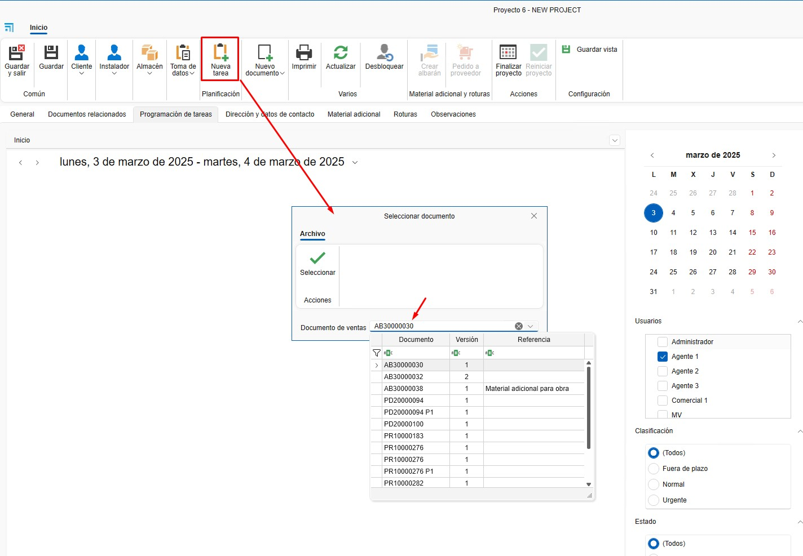
  
  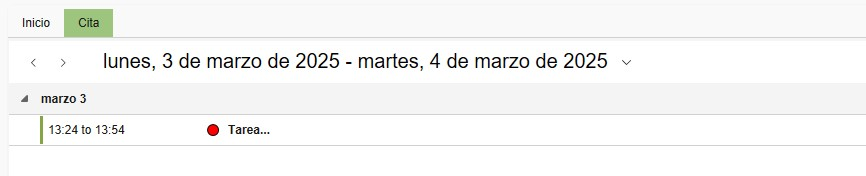

---

## 3. Clientes
El cliente se asocia a uno o más proyectos.

### 3.1. Creación de Cliente
- Desde el apartado de Ventas, puedes acceder a Clientes.

  

#### 3.1.1. Nuevo Cliente
- Crea un cliente desde el botón "Nuevo".

  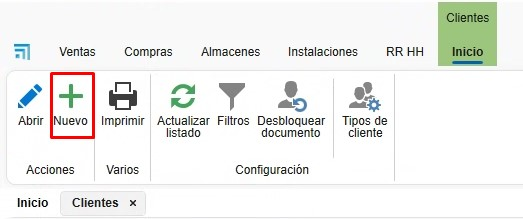

#### 3.1.2. Detalle del Cliente
- Asigna un nombre y rellena los campos necesarios del cliente.
  - Nombre.
  - Nombre Comercial.
  - Dirección.
  - NIF/CIF.
  - Etc.

  

#### 3.1.3. Otros Datos
- Se pueden rellenar otros datos del cliente accediendo a otras pestañas.
  - Datos de contacto.
  - Otros contactos.
  - Datos bancarios.
  - Información comercial.
  - Etc.

  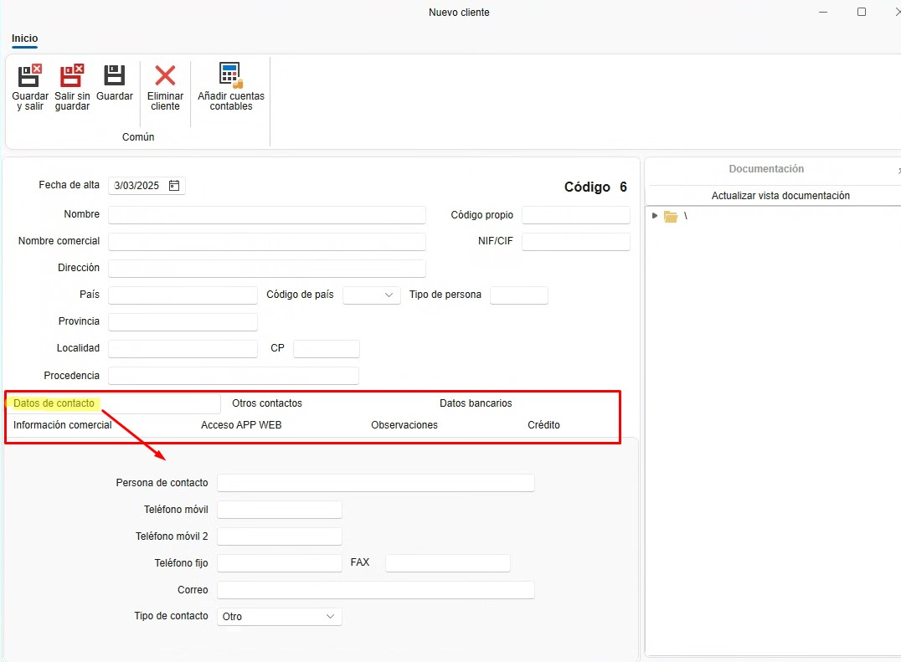

#### 3.1.4. Documentación
- Desde **Documentación**, puedes subir documentación relacionada con el cliente.

  

- Con un doble clic sobre la carpeta principal, se abre la ruta donde está el código del cliente.

  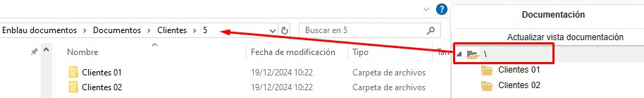

---

## 4. Proveedores
El proveedor se asocia a uno o más proyectos.

### 4.1. Creación de Proveedor
- Desde el apartado de Compras, puedes acceder a Proveedores.

  

#### 4.1.1. Nuevo Proveedor
- Crea un proveedor desde el botón "Nuevo".

  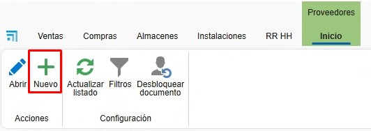

#### 4.1.2. Detalle del Proveedor
- Asigna un nombre y rellena los campos necesarios del proveedor.
  - Nombre.
  - Nombre Comercial.
  - Dirección.
  - NIF/CIF.
  - Etc.

  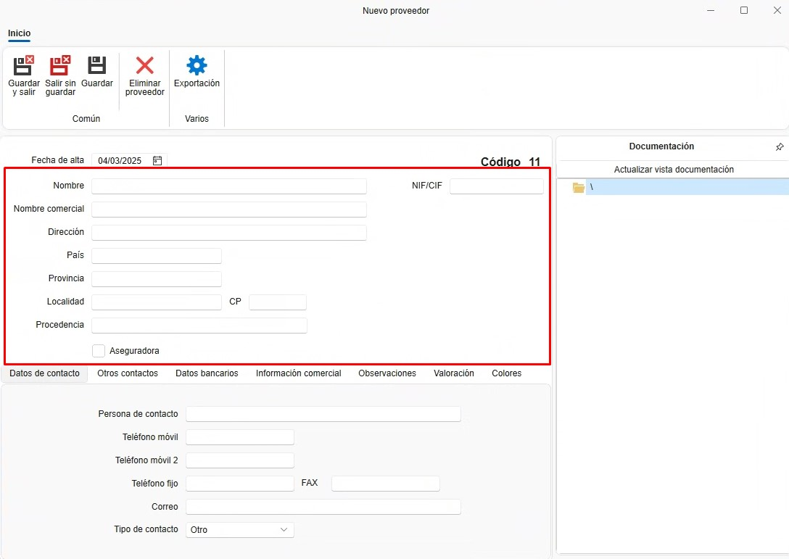

#### 4.1.3. Otros Datos
- Se pueden rellenar otros datos del proveedor accediendo a otras pestañas.
  - Datos de contacto.
  - Otros contactos.
  - Datos bancarios.
  - Información comercial.
  - Etc.

  

#### 4.1.4. Documentación
- Desde **Documentación**, puedes subir documentación relacionada con el proveedor.

  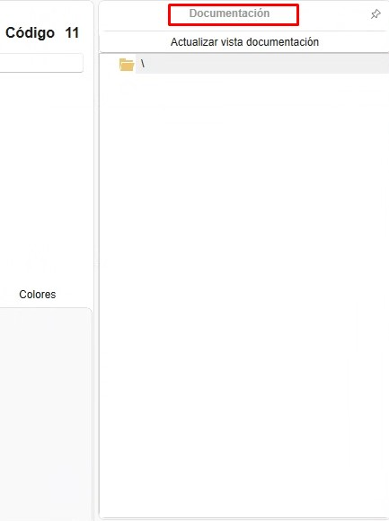

- Con un doble clic sobre la carpeta principal, se abre la ruta donde está el código del proveedor.

  

---