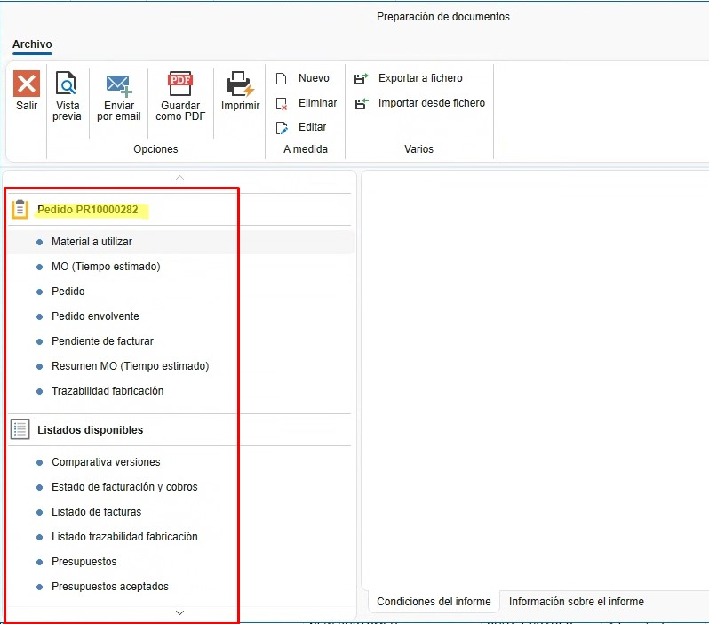
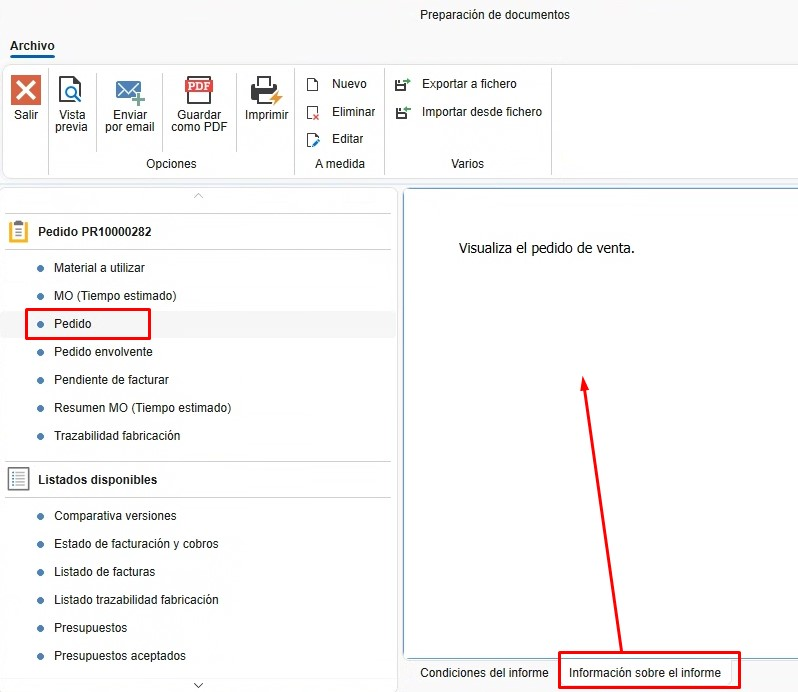
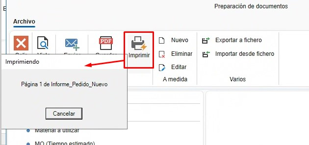
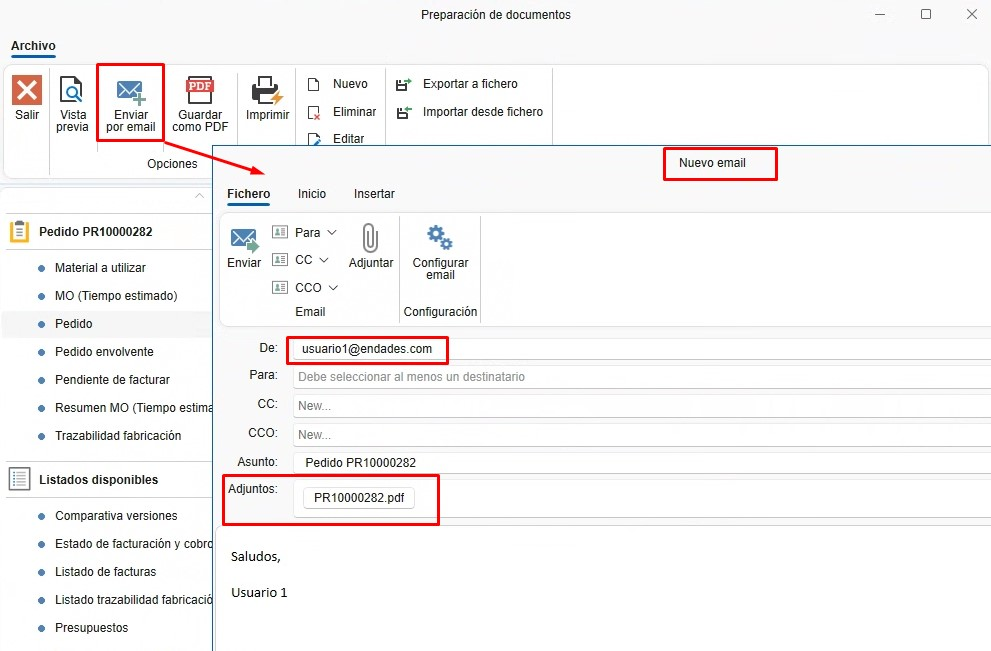

# 5. Informes

---

<!-- ## Índice
1. [Introducción](#1-introducción)
2. [Tipos de Informes](#2-tipos-de-informes)
3. [Imprimir/Guardar/Enviar Informes](#3-imprimirguardarenviar-informes)
   - [3.1. Preparación de Documento](#31-preparación-de-documento)
     - [3.1.1. Condiciones del Informe](#311-condiciones-del-informe)
     - [3.1.2. Información sobre el Informe](#312-información-sobre-el-informe)
     - [3.1.3. Vista Previa](#313-vista-previa)
     - [3.1.4. Guardar como PDF](#314-guardar-como-pdf)
     - [3.1.5. Imprimir](#315-imprimir)
     - [3.1.6. Enviar por Email](#316-enviar-por-email) -->

---

## 1. Introducción
Este manual está diseñado para guiar a los usuarios sobre cómo sacar documentos e informes en ENBLAU. De esta manera, se pueden imprimir o enviar por correo.

---

## 2. Tipos de Informes
Para cada documento de venta o compra, se pueden generar diferentes tipos de informes según sea necesario.

### 2.1. Documentos de Ventas
- Presupuesto
- Pedido
- Medición
- Producción
- Albarán
- Factura

### 2.2. Documentos de Compra
- Pedido
- Albarán
- Factura

---

## 3. Imprimir/Guardar/Enviar Informes
Desde cualquier listado de documentos (por ejemplo, Documentos de venta), selecciona cualquier tipo de documento y haz clic en **Imprimir**.

  

### 3.1. Preparación de Documento
En la ventana **Preparación de documentos**, aparece un listado de informes en la parte derecha de la ventana relacionados con el documento.

  

#### 3.1.1. Condiciones del Informe
- Al seleccionar el tipo de informe, en la pestaña "Condiciones del informe" se muestran las condiciones que debe cumplir el documento para poder emitirlo.

  

#### 3.1.2. Información sobre el Informe
- Para cada tipo de informe, en la pestaña "Información sobre el informe" se muestra una breve explicación sobre el informe.

  

#### 3.1.3. Vista Previa
- Antes de imprimir o enviar el informe por correo, puedes hacer una vista previa para verificar el documento.

  

#### 3.1.4. Guardar como PDF
- Existe la opción de guardar como PDF. Esta opción abrirá la ruta por defecto previamente configurada para el documento de venta o compra. (Se puede cambiar esta ruta al exportar).

  

#### 3.1.5. Imprimir
- Para imprimir los informes, selecciona el botón **Imprimir**, elige la impresora que tengas configurada en el servidor e imprímelo.

  

#### 3.1.6. Enviar por Email
- Para enviar el informe por correo, selecciona **Enviar por email**. Se abrirá una ventana "Nuevo email" con el email del usuario por defecto (esta configuración se realizó previamente en el apartado "Cuentas de email". Para más información, sigue este enlace: [1. Configuración Inicial de ENBLAU](CO_Configuracion_Inicial_ENBLAU.md)).

  

- Desde la ventana "Nuevo email", puedes adjuntar otros documentos, escribir en el cuerpo del correo, añadir correos en copia, etc.

---