# 2. Creación de materiales proprios en enMATERIALES

<!-- ## Índice

1. [Introducción](#1-introducción)
2. [Definición de Materiales](#2-definición-de-materiales)
   - [2.1. Tipos de Materiales](#21-tipos-de-materiales)
   - [2.2. Artículos y Colores](#22-artículos-y-colores)
3. [Creación de Materiales](#3-creación-de-materiales)
   - [3.1. Definir un Artículo](#31-definir-un-artículo)
   - [3.2. Creación de Colores](#32-creación-de-colores)
   - [3.3. Creación de un Material Base](#33-creación-de-un-material-base)
4. [Gestión de Proveedores](#4-gestión-de-proveedores)
5. [Comercial y Stock](#5-comercial-y-stock)
   - [5.1. Datos de Compra y Proveedores](#51-datos-de-compra-y-proveedores)
   - [5.2. Asignación de Referencias](#52-asignación-de-referencias)
6. [Tipología de Materiales](#6-tipología-de-materiales)
   - [6.1. Piezas](#61-piezas)
   - [6.2. Barras](#62-barras)
   - [6.3. Superficies](#63-superficies)
   - [6.4. Juntas](#64-juntas)
7. [Estándares a Seguir](#7-estándares-a-seguir)
8. [Creación de Documentos de Compra](#8-creación-de-documentos-de-compra)
9. [Conclusión](#9-conclusión) -->

---

## 1. Introducción

Este manual tiene como objetivo guiar al usuario en el proceso de alta y gestión de materiales prorios en enMATERIAL. Asegúrate de seguir las instrucciones detalladas para garantizar una correcta definición y organización de los materiales.

---

## 2. Definición de Materiales

Los materiales pueden clasificarse en diferentes tipos según sus propiedades y características. A continuación, se describen los principales tipos:

### 2.1. Tipos de Materiales

- **Piezas**: Se calculan por unidad y son los materiales más comunes y sencillos de definir.
- **Barras**: Se calculan por metro lineal y requieren información adicional, como longitud.
- **Superficies**: Se calculan por metro cuadrado y pueden incluir características adicionales.
- **Juntas**: Se calculan por metro lineal y tienen especificaciones especiales para su aplicación.

### 2.2. Artículos y Colores

Los materiales se definen dentro de la sección "Artículos", mientras que los acabados se gestionan en "Colores" y la materia prima en "Materiales".

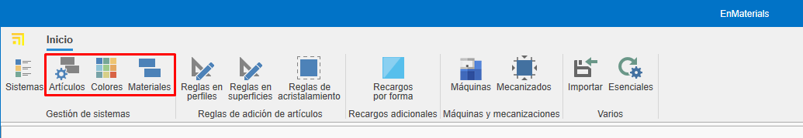

---

## 3. Creación de Materiales

Para dar de alta un material, sigue estos pasos:

### 3.1. Definir un Artículo

1. Accede a la sección de "Artículos".

   
   

2. Desde la pestaña **General** Asigna una referencia, un tipo de cálculo y un material.

   

3. Organiza los artículos por niveles utilizando los campos "Familia1", "Familia2", etc.

   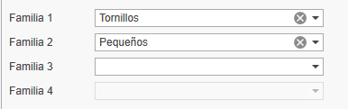

4. Completa la descripción de compra (para proveedores) y la de venta (para clientes).

   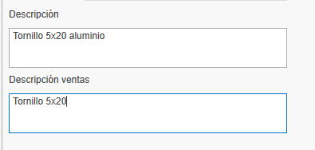

5. Asigna un material base arrastrando un material desde el árbol de materiales en la cinta derecha.

   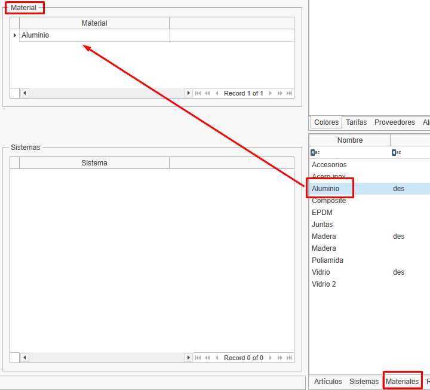

6. Añade imágenes al material. Asegúrate de optimizar las imágenes para evitar lentitud en la base de datos.

   

> **Nota:** El apartado "General" del articulo es igual para todos los tipos de calculo.

### 3.2. Creación de Colores

1. Accede a la sección de "Colores".

   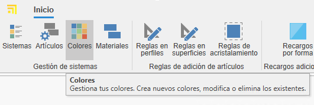
   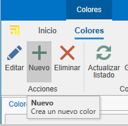

2. Asigna una referencia, nombre y un color o textura.

   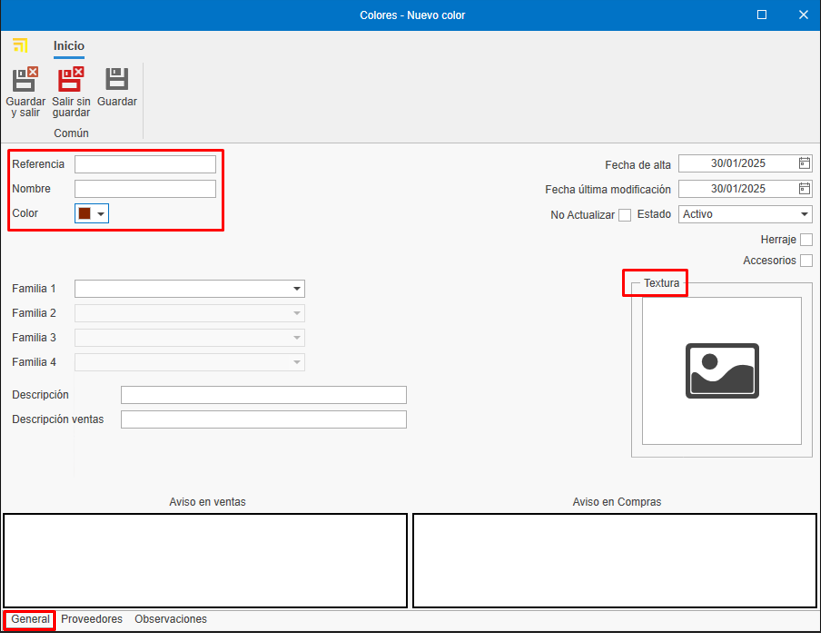

3. Asigna un proveedor desde la pestaña "Proveedor" arrastrando el proveedor desde la ventana derecha.

   

### 3.3. Creación de un Material Base

1. Accede a la sección de "Materiales".

   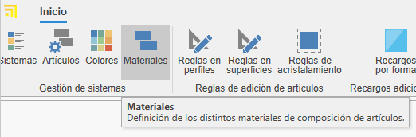
   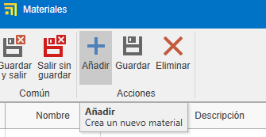

2. Indica el nombre, color y marca el check "Material" para que aparezca como materia prima.

   

> **Nota:** Para generar automáticamente la carta RAL de colores y materiales base, selecciona el botón **Esenciales** en la barra de "Inicio".

   

   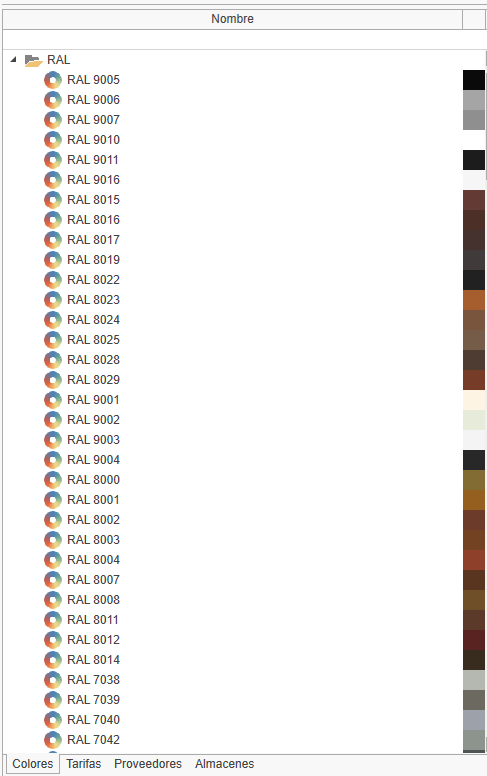
   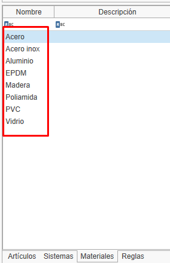

---

## 4. Gestión de Proveedores

Antes de dar de alta un material, verifica si el proveedor ya está registrado en ENBLAU en la sección "Compras > Proveedores". Si no está registrado, créalo siguiendo los estándares definidos.

   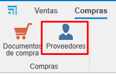

---

## 5. Comercial y Stock

Una vez definido el material, completa su información en las secciones de comercial y stock.

### 5.1. Datos de Compra y Proveedores

Asigna proveedores, unidades y precios de compra según cada color del material.

   

> **Nota:** Puedes añadir una referencia de proveedor si es distinta de la registrada en la base de datos.

### 5.2. Asignación de Referencias

Cada color y material tendrá una referencia única _(Referencia Artículo + Referencia Color)_. Arrastra uno o más colores desde la pestaña de colores en la ventana derecha.

   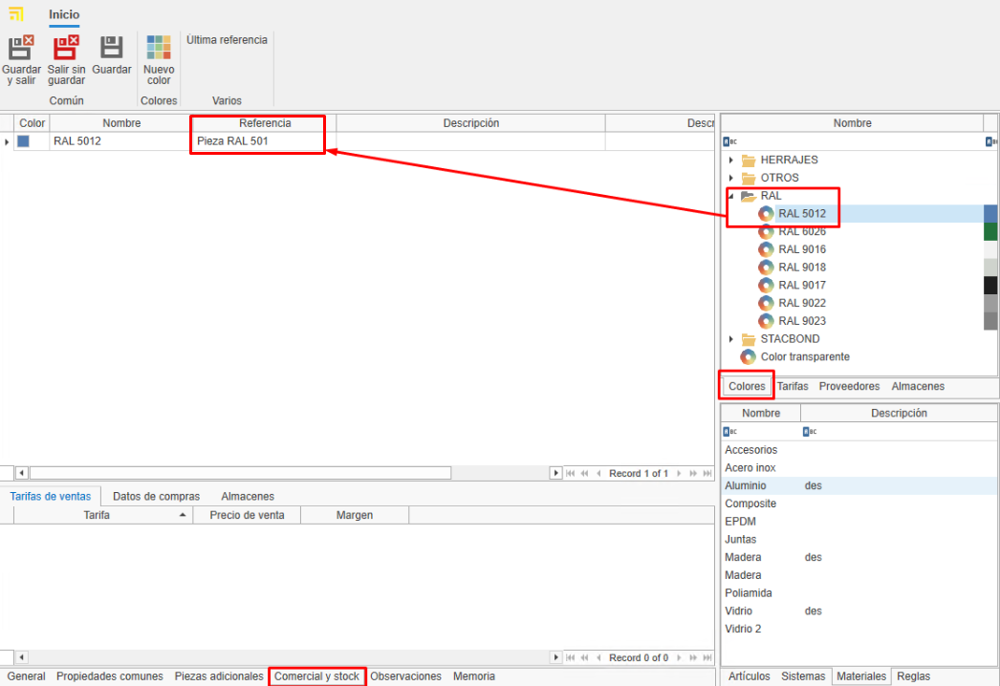

---

## 6. Tipología de Materiales y deatos adicionales

### 6.1. Piezas

- Materiales individuales gestionados por unidad (accesorios, tornillos, etc.).
- Se valoran por unidad.
- En la pestaña "Propiedades Comunes", puedes añadir campos adicionales si es necesario.

   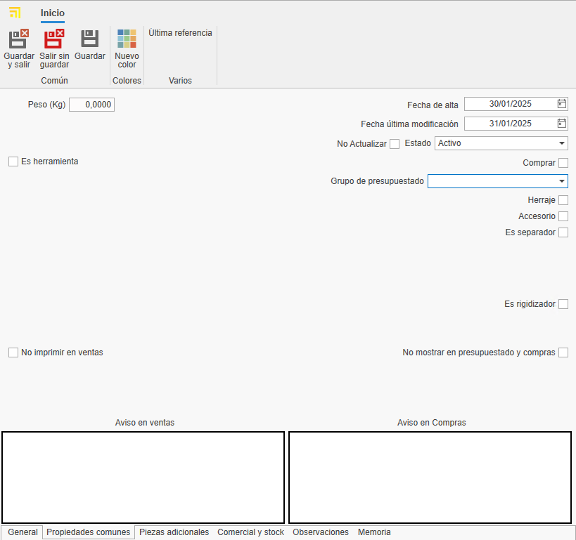

### 6.2. Barras

- Materiales definidos por longitud y otros atributos técnicos.
- Se valoran por metro lineal.
- En la pestaña "Propiedades Comunes", indica la longitud de la barra (obligatorio).

   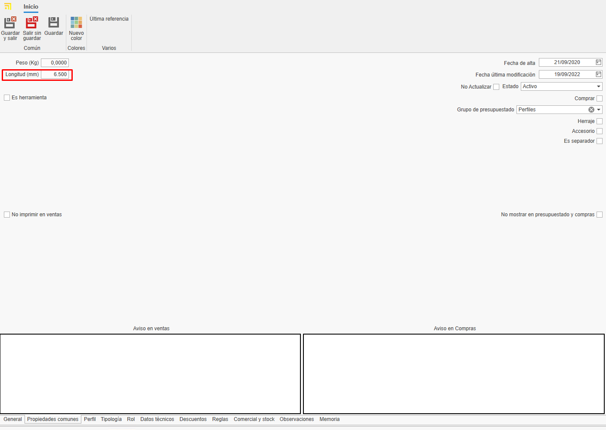

- Para perfiles, añade información adicional como distancia de seguridad y retal mínimo/máximo. Ese tipo de informacion son opcionales.

   

> **Nota:** Los apartados como Tipología, Rol, Datos Técnicos, Descuentos y Reglas no son necesarios para creación de materiales propios, ya que son información relevante únicamente para los materiales dibujados.

### 6.3. Superficies

- Materiales definidos por metro cuadrado (vidrios, chapas, etc.).
- Se valora por M2.
- En la pestaña "Propiedades Comunes", indica el alto y ancho de la superficie.

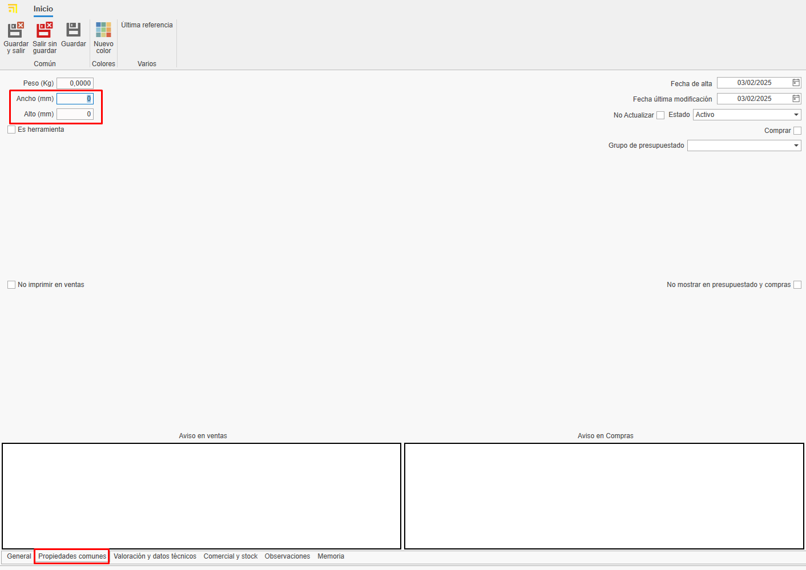 

- En la pestaña "Valoración y datos técnicos", indica algunos datos dependiendo del tipo de la superficie y su necesidad. Por ejemplo: Espesor, tipo de superficie, precios por M2 (marcar el check "M2 por proveedor" si el precio se calcula por proveedor), etc... 

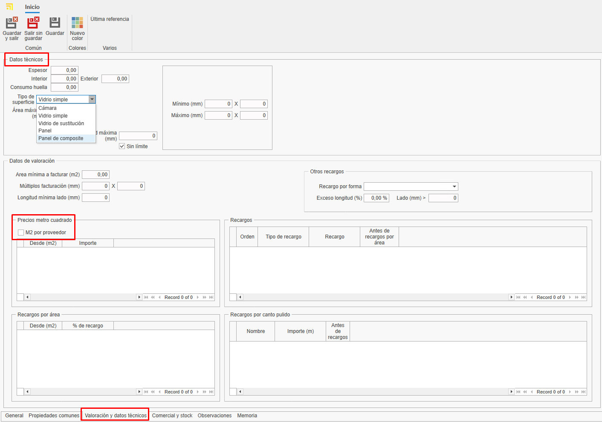 

### 6.4. Juntas

- Materiales definidos por metro lineal.
- Se valora por metro lineal.
- En la pestaña "Propiedades Comunes", se puede indicar la longitud si lo ves necesario.

   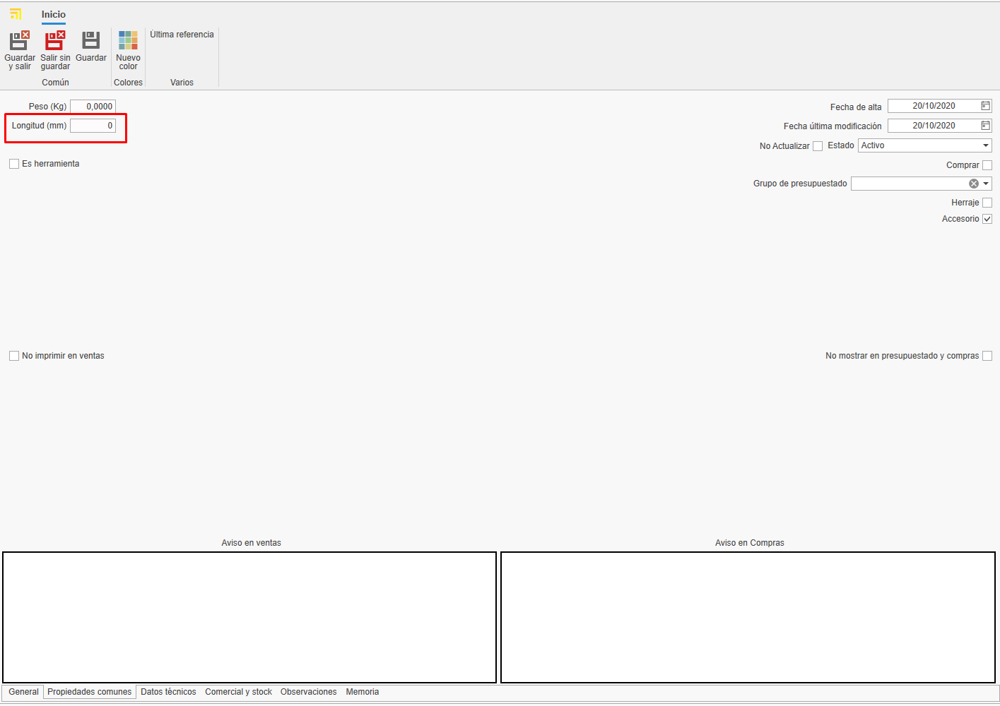

---

## 7. Estándares a Seguir

Para garantizar una correcta gestión, sigue estos estándares:

- Usa mayúsculas en nombres y referencias.
- Verifica la existencia de proveedores y materiales antes de darlos de alta.
- Mantén un formato uniforme en referencias de materiales y colores.
- Guardar siempre los cambio.

---

## 8. Creación de Documentos de Compra ENBLAU

Para comprobar si el articulo esta dado de alta abrir ENBLAU y crear un documento de compra:

1. Crea un pedido de compra y selecciona el proveedor.
2. En el pedido de compra busca y agrega el material desde la ventana derecha. Arrastra y selecciona el color asociado.

   

3. Valida el precio asignado al proveedor.

   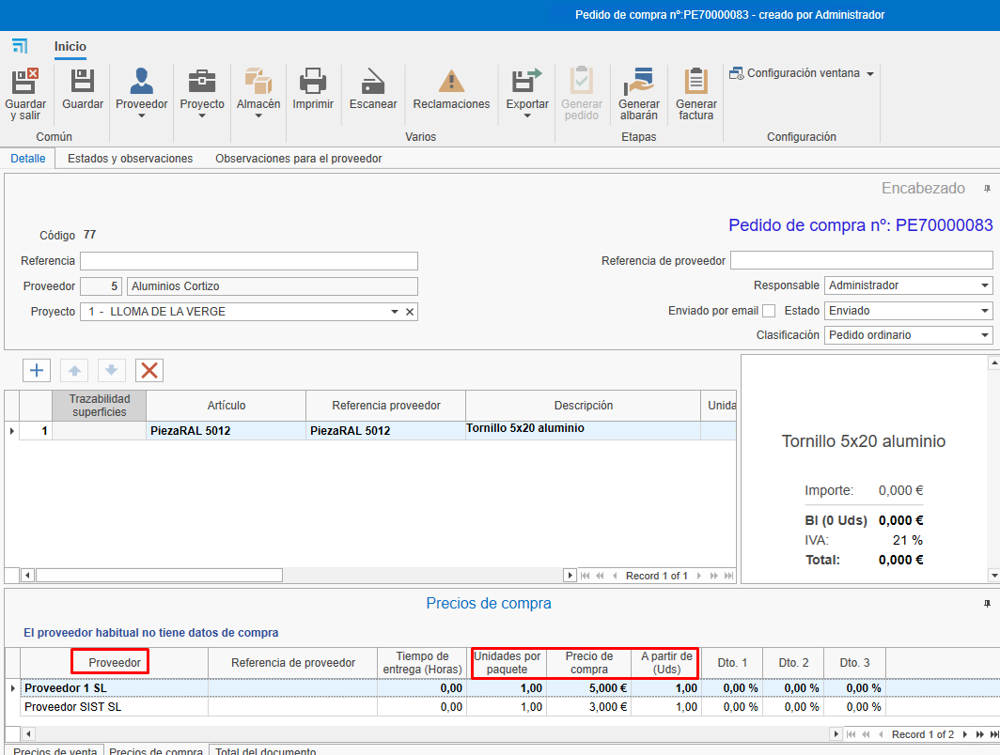

   - Si el material tiene mas de un proveedor asignado, puedes selecionar el proveedor deseado con un doble click sobre el proveedor.
---

## 9. Conclusión

Siguiendo este manual, podrás dar de alta y gestionar materiales de manera eficiente en el sistema, asegurando una correcta organización y optimización de los procesos de compra y venta.

---
